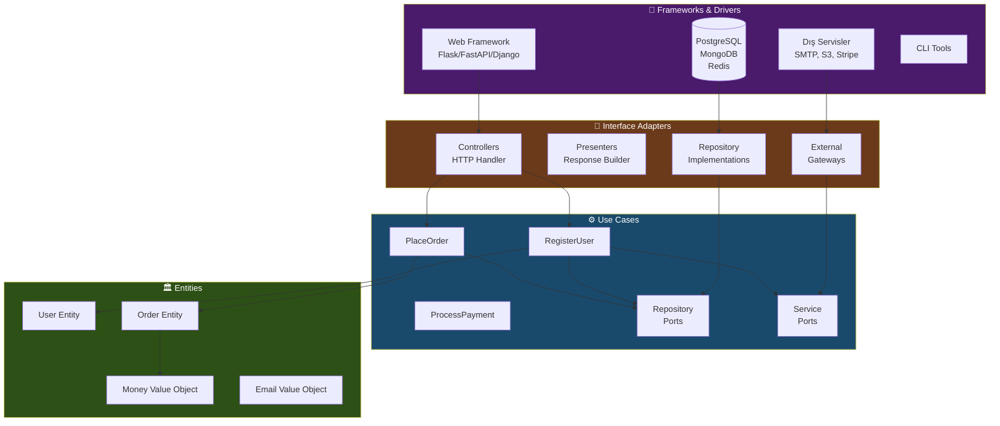
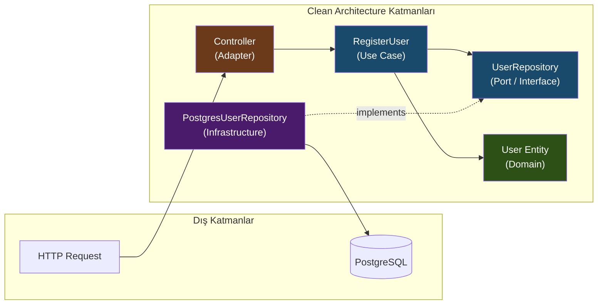
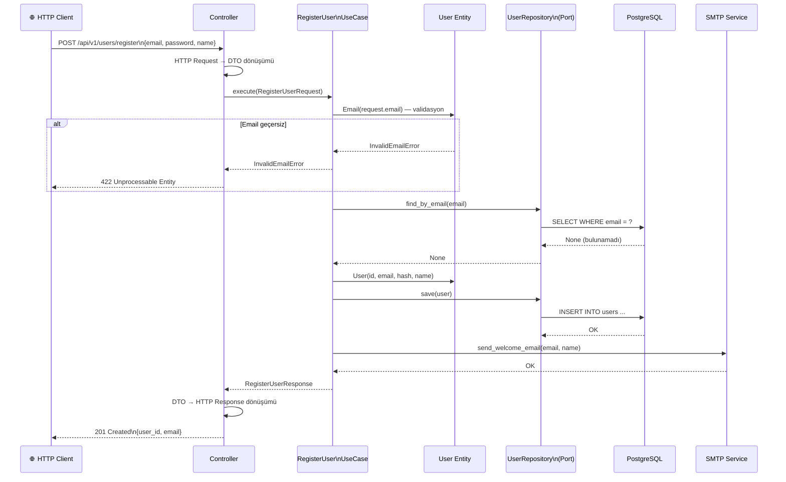
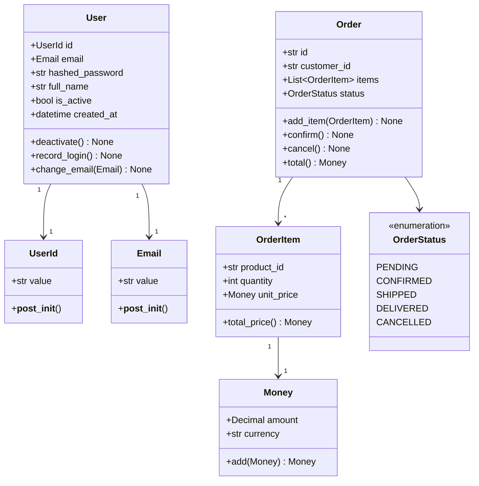
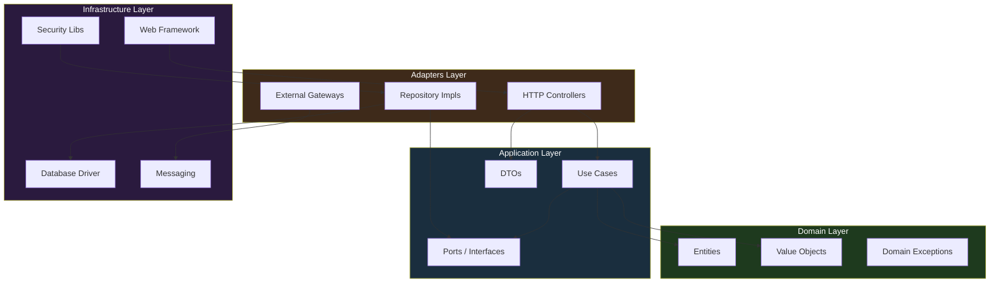
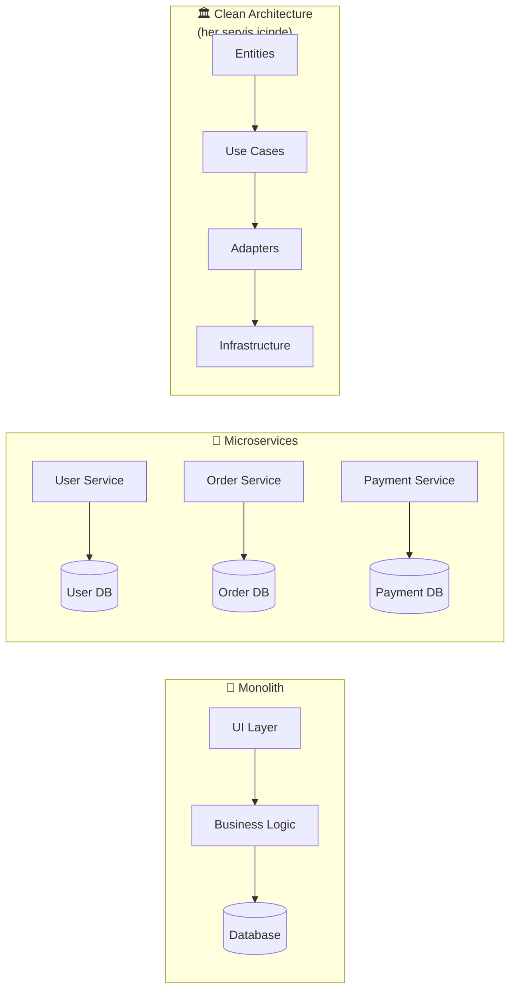

# 🏛️ Clean Architecture: Kapsamlı Teknik Rehber

> *"The goal of software architecture is to minimize the human resources required to build and maintain the required system."*
> — Robert C. Martin (Uncle Bob)

---

## 📋 İçindekiler

- [Giriş ve Motivasyon](#-giriş-ve-motivasyon)
- [Temel Prensipler](#-temel-prensipler)
  - [SOLID Prensipleri](#solid-prensipleri)
  - [Bağımlılık Kuralı](#bağımlılık-kuralı-dependency-rule)
- [Mimari Katmanlar](#-mimari-katmanlar)
  - [Entities](#1-entities-varlıklar)
  - [Use Cases](#2-use-cases-uygulama-iş-kuralları)
  - [Interface Adapters](#3-interface-adapters-arayüz-adaptörleri)
  - [Frameworks & Drivers](#4-frameworks--drivers)
- [Mimari Diyagramlar](#-mimari-diyagramlar)
- [Python ile Tam Örnek Uygulama](#-python-ile-tam-örnek-uygulama)
- [Dosya / Klasör Yapısı](#-dosya--klasör-yapısı)
- [Karşılaştırma: Monolith vs Microservices vs Clean Architecture](#-karşılaştırma)
- [Avantajlar ve Dezavantajlar](#-avantajlar-ve-dezavantajlar)
- [Ne Zaman Kullanılmalı?](#-ne-zaman-kullanılmalı)
- [Best Practices](#-best-practices)
- [Yaygın Hatalar](#-yaygın-hatalar)
- [Sonuç](#-sonuç)

---

## Giriş ve Motivasyon

### Sorun: Yazılım Çürümesi (Software Rot)

Çoğu yazılım projesi zamanla bir "büyük çamur topu" (Big Ball of Mud) haline gelir: her şey her şeye bağlı, değişiklik yapmak riski artırır, test yazmak imkânsız görünür ve yeni geliştirici onboarding haftalar alır.

Bu durumun temel nedeni **yanlış bağımlılık yönetimidir.**

```
❌ Kötü Tasarım: İş Mantığı → Veritabanı → Framework → UI
   (Her şey birbirine sıkı sıkıya bağlı)

✅ Clean Architecture: İş Mantığı ← Bağımlılık Tersine Çevirme → Dış Dünya
   (İş mantığı hiçbir şeye bağlı değil, her şey ona bağlı)
```

### Clean Architecture Nedir?

**Clean Architecture**, Robert C. Martin tarafından 2012'de formüle edilen ve çeşitli mimari yaklaşımları (Hexagonal Architecture, Onion Architecture, DCI) tek bir çatı altında toplayan bir yazılım tasarım felsefesidir.

Temel iddiası şudur: **iş kuralları (business logic) hiçbir dış unsura bağımlı olmamalıdır** — ne veritabanına, ne web framework'üne, ne kullanıcı arayüzüne, ne de üçüncü taraf kütüphanelere.

---

## 🧱 Temel Prensipler

### SOLID Prensipleri

Clean Architecture, SOLID prensipleri üzerine inşa edilmiştir. Bunları somut örneklerle ele alalım.

---

#### S — Single Responsibility Principle (Tek Sorumluluk)

> Bir sınıfın değişmesi için yalnızca bir nedeni olmalıdır.

```python
# ❌ YANLIŞ: Tek sınıf çok fazla şey yapıyor
class UserService:
    def register(self, email, password):
        # Validasyon
        if "@" not in email:
            raise ValueError("Geçersiz email")
        # Şifre hashleme
        hashed = hashlib.sha256(password.encode()).hexdigest()
        # Veritabanı kaydı
        db.execute("INSERT INTO users ...", email, hashed)
        # Email gönderme
        smtp.send(email, "Hoşgeldiniz!")
        # Loglama
        logger.info(f"Yeni kullanıcı: {email}")

# ✅ DOĞRU: Her sınıfın tek sorumluluğu var
class UserValidator:
    def validate_email(self, email: str) -> bool:
        return "@" in email and "." in email.split("@")[1]

class PasswordHasher:
    def hash(self, password: str) -> str:
        return hashlib.sha256(password.encode()).hexdigest()

class UserRepository:
    def save(self, user: User) -> None:
        self._db.execute("INSERT INTO users ...", user.email, user.hashed_password)

class WelcomeEmailSender:
    def send(self, email: str) -> None:
        self._smtp.send(email, "Hoşgeldiniz!")
```

---

#### O — Open/Closed Principle (Açık/Kapalı)

> Yazılım varlıkları genişletmeye açık, değişime kapalı olmalıdır.

```python
from abc import ABC, abstractmethod

# Temel soyutlama — değişmez
class NotificationSender(ABC):
    @abstractmethod
    def send(self, user_id: str, message: str) -> None:
        pass

# Yeni kanallar eklemek için mevcut kodu DEĞİŞTİRMEYİZ, UZATIRIZ
class EmailNotificationSender(NotificationSender):
    def send(self, user_id: str, message: str) -> None:
        # Email gönder
        ...

class SMSNotificationSender(NotificationSender):
    def send(self, user_id: str, message: str) -> None:
        # SMS gönder
        ...

class PushNotificationSender(NotificationSender):
    def send(self, user_id: str, message: str) -> None:
        # Push notification gönder
        ...
```

---

#### L — Liskov Substitution Principle (Liskov Yerine Geçme)

> Alt sınıflar, üst sınıflarının yerine geçebilmelidir.

```python
# ❌ YANLIŞ: Alt sınıf üst sınıfın davranışını kırıyor
class Rectangle:
    def set_width(self, w): self.width = w
    def set_height(self, h): self.height = h
    def area(self): return self.width * self.height

class Square(Rectangle):  # LSP ihlali!
    def set_width(self, w):
        self.width = w
        self.height = w  # Beklenmedik yan etki!

# ✅ DOĞRU: Ortak interface, bağımsız implementasyonlar
class Shape(ABC):
    @abstractmethod
    def area(self) -> float:
        pass

class Rectangle(Shape):
    def __init__(self, width: float, height: float):
        self.width = width
        self.height = height
    def area(self) -> float:
        return self.width * self.height

class Square(Shape):
    def __init__(self, side: float):
        self.side = side
    def area(self) -> float:
        return self.side ** 2
```

---

#### I — Interface Segregation Principle (Arayüz Ayrıştırma)

> İstemciler kullanmadıkları metodları implement etmeye zorlanmamalıdır.

```python
# ❌ YANLIŞ: Şişirilmiş interface
class UserRepository(ABC):
    @abstractmethod
    def find_by_id(self, id: str): pass
    @abstractmethod
    def save(self, user): pass
    @abstractmethod
    def delete(self, id: str): pass
    @abstractmethod
    def find_all_with_pagination(self, page, size): pass
    @abstractmethod
    def generate_report(self): pass  # Depo sınıfı neden rapor üretiyor?

# ✅ DOĞRU: Küçük, odaklı interface'ler
class UserReader(ABC):
    @abstractmethod
    def find_by_id(self, id: str) -> Optional[User]: pass
    @abstractmethod
    def find_all(self) -> list[User]: pass

class UserWriter(ABC):
    @abstractmethod
    def save(self, user: User) -> None: pass
    @abstractmethod
    def delete(self, id: str) -> None: pass

class UserReportGenerator(ABC):
    @abstractmethod
    def generate_report(self) -> Report: pass
```

---

#### D — Dependency Inversion Principle (Bağımlılık Tersine Çevirme)

> Üst seviye modüller alt seviye modüllere bağımlı olmamalıdır. Her ikisi de soyutlamalara bağımlı olmalıdır.

```python
# ❌ YANLIŞ: Yüksek seviyeli modül, düşük seviyeli detaya bağımlı
class OrderService:
    def __init__(self):
        self.db = PostgreSQLDatabase()  # Somut implementasyona bağımlı!
        self.mailer = SendGridEmailer()  # Somut implementasyona bağımlı!

# ✅ DOĞRU: Soyutlamalara bağımlı, DI ile çözümleniyor
class OrderService:
    def __init__(
        self,
        order_repo: OrderRepository,     # Soyut
        notification: NotificationPort,  # Soyut
    ):
        self._order_repo = order_repo
        self._notification = notification
```

---

### Bağımlılık Kuralı (Dependency Rule)

> **"Kaynak kodu bağımlılıkları yalnızca içe doğru işaret edebilir."**

Bu, Clean Architecture'ın kalbindeki tek ve en kritik kuraldır. İç katmanlar dış katmanlar hakkında hiçbir şey bilmez.

```
┌─────────────────────────────────────────────────┐
│  Frameworks & Drivers (Dış)                     │
│   ┌─────────────────────────────────────────┐   │
│   │  Interface Adapters                     │   │
│   │   ┌───────────────────────────────┐     │   │
│   │   │  Use Cases                    │     │   │
│   │   │   ┌───────────────────┐       │     │   │
│   │   │   │    Entities       │       │     │   │
│   │   │   │  (İş Kuralları)   │       │     │   │
│   │   │   └───────────────────┘       │     │   │
│   │   └───────────────────────────────┘     │   │
│   └─────────────────────────────────────────┘   │
└─────────────────────────────────────────────────┘

         Bağımlılık yönü: Dıştan → İçe ✅
         Bağımlılık yönü: İçten → Dışa ❌
```

---

## 🎯 Mimari Katmanlar

### 1. Entities (Varlıklar)

**En iç katman.** Kurumun veya uygulamanın en temel iş kurallarını içerir. Framework, veritabanı, UI gibi hiçbir dış unsurdan habersizdir. En az değişen katmandır.

**Özellikler:**
- Saf Python sınıfları (hiçbir import gerekmez)
- Kendi kendini validate eder
- Hiçbir dış kütüphane bağımlılığı yoktur
- Birim testleri infrastructure olmadan çalışır

```python
# domain/entities/user.py
from dataclasses import dataclass, field
from datetime import datetime
from typing import Optional
import re
import uuid


class InvalidEmailError(ValueError):
    pass


class WeakPasswordError(ValueError):
    pass


@dataclass
class UserId:
    """Kimlik nesnesi — değer nesnesi (Value Object)"""
    value: str = field(default_factory=lambda: str(uuid.uuid4()))

    def __post_init__(self):
        if not self.value:
            raise ValueError("UserId boş olamaz")


@dataclass
class Email:
    """Email değer nesnesi — kendi validasyonunu yapar"""
    value: str

    def __post_init__(self):
        pattern = r'^[a-zA-Z0-9._%+-]+@[a-zA-Z0-9.-]+\.[a-zA-Z]{2,}$'
        if not re.match(pattern, self.value):
            raise InvalidEmailError(f"Geçersiz email formatı: {self.value}")
        self.value = self.value.lower()


@dataclass
class User:
    """
    Kullanıcı Entity'si.
    Yalnızca iş kurallarını içerir — veritabanı, web veya UI hakkında hiçbir şey bilmez.
    """
    id: UserId
    email: Email
    hashed_password: str
    full_name: str
    is_active: bool = True
    created_at: datetime = field(default_factory=datetime.utcnow)
    last_login: Optional[datetime] = None

    def deactivate(self) -> None:
        """İş kuralı: Bir kullanıcı deaktive edilebilir."""
        if not self.is_active:
            raise ValueError("Kullanıcı zaten pasif durumda")
        self.is_active = False

    def record_login(self) -> None:
        """İş kuralı: Giriş zamanı kaydedilir."""
        if not self.is_active:
            raise PermissionError("Pasif kullanıcı giriş yapamaz")
        self.last_login = datetime.utcnow()

    def change_email(self, new_email: Email) -> None:
        """İş kuralı: Email değiştirme."""
        if new_email.value == self.email.value:
            raise ValueError("Yeni email mevcut email ile aynı")
        self.email = new_email
```

```python
# domain/entities/order.py
from dataclasses import dataclass, field
from decimal import Decimal
from enum import Enum
from typing import List
import uuid


class OrderStatus(Enum):
    PENDING = "pending"
    CONFIRMED = "confirmed"
    SHIPPED = "shipped"
    DELIVERED = "delivered"
    CANCELLED = "cancelled"


@dataclass
class Money:
    """Para birimi değer nesnesi"""
    amount: Decimal
    currency: str = "TRY"

    def __post_init__(self):
        if self.amount < 0:
            raise ValueError("Para miktarı negatif olamaz")
        if len(self.currency) != 3:
            raise ValueError("Geçersiz para birimi kodu")

    def add(self, other: "Money") -> "Money":
        if self.currency != other.currency:
            raise ValueError("Farklı para birimleri toplanamaz")
        return Money(self.amount + other.amount, self.currency)


@dataclass
class OrderItem:
    product_id: str
    quantity: int
    unit_price: Money

    def __post_init__(self):
        if self.quantity <= 0:
            raise ValueError("Miktar pozitif olmalıdır")

    @property
    def total_price(self) -> Money:
        return Money(self.unit_price.amount * self.quantity, self.unit_price.currency)


@dataclass
class Order:
    id: str = field(default_factory=lambda: str(uuid.uuid4()))
    customer_id: str = ""
    items: List[OrderItem] = field(default_factory=list)
    status: OrderStatus = OrderStatus.PENDING

    def add_item(self, item: OrderItem) -> None:
        """İş kuralı: Tamamlanmış siparişe ürün eklenemez."""
        if self.status not in (OrderStatus.PENDING,):
            raise ValueError("Sadece bekleyen siparişlere ürün eklenebilir")
        self.items.append(item)

    def confirm(self) -> None:
        """İş kuralı: Boş sipariş onaylanamaz."""
        if not self.items:
            raise ValueError("Siparişte en az bir ürün olmalıdır")
        if self.status != OrderStatus.PENDING:
            raise ValueError("Yalnızca bekleyen siparişler onaylanabilir")
        self.status = OrderStatus.CONFIRMED

    def cancel(self) -> None:
        """İş kuralı: Teslim edilmiş sipariş iptal edilemez."""
        if self.status == OrderStatus.DELIVERED:
            raise ValueError("Teslim edilmiş sipariş iptal edilemez")
        self.status = OrderStatus.CANCELLED

    @property
    def total(self) -> Money:
        if not self.items:
            return Money(Decimal("0"))
        result = self.items[0].total_price
        for item in self.items[1:]:
            result = result.add(item.total_price)
        return result
```

---

### 2. Use Cases (Uygulama İş Kuralları)

**İkinci katman.** Uygulamaya özgü iş kurallarını içerir. Entity'leri orkestre eder. Verinin nasıl aktığını belirler. Port (arayüz) tanımlar, adaptör implementasyonu yapmaz.

**Özellikler:**
- Her use case tek bir iş operasyonunu temsil eder
- Port'lar (interface) bu katmanda tanımlanır
- DTO (Data Transfer Object) bu katmanda tanımlanır
- Dış altyapıdan (DB, HTTP) tamamen bağımsızdır

```python
# application/ports/repositories.py
from abc import ABC, abstractmethod
from typing import Optional, List
from domain.entities.user import User, UserId, Email


class UserRepository(ABC):
    """
    Port tanımı — bu interface Use Case katmanına aittir.
    Implementasyonu Infrastructure katmanında yapılır.
    """

    @abstractmethod
    def find_by_id(self, user_id: UserId) -> Optional[User]:
        pass

    @abstractmethod
    def find_by_email(self, email: Email) -> Optional[User]:
        pass

    @abstractmethod
    def save(self, user: User) -> None:
        pass

    @abstractmethod
    def delete(self, user_id: UserId) -> None:
        pass


class OrderRepository(ABC):
    @abstractmethod
    def find_by_id(self, order_id: str) -> Optional[object]:
        pass

    @abstractmethod
    def find_by_customer(self, customer_id: str) -> List[object]:
        pass

    @abstractmethod
    def save(self, order: object) -> None:
        pass
```

```python
# application/ports/services.py
from abc import ABC, abstractmethod


class PasswordHasher(ABC):
    @abstractmethod
    def hash(self, password: str) -> str:
        pass

    @abstractmethod
    def verify(self, password: str, hashed: str) -> bool:
        pass


class NotificationService(ABC):
    @abstractmethod
    def send_welcome_email(self, email: str, full_name: str) -> None:
        pass

    @abstractmethod
    def send_password_reset_email(self, email: str, token: str) -> None:
        pass
```

```python
# application/use_cases/register_user.py
from dataclasses import dataclass
from domain.entities.user import User, UserId, Email
from application.ports.repositories import UserRepository
from application.ports.services import PasswordHasher, NotificationService


@dataclass
class RegisterUserRequest:
    """Input DTO — Use Case'e gelen veri"""
    email: str
    password: str
    full_name: str


@dataclass
class RegisterUserResponse:
    """Output DTO — Use Case'den çıkan veri"""
    user_id: str
    email: str
    message: str


class UserAlreadyExistsError(Exception):
    pass


class RegisterUserUseCase:
    """
    Kullanıcı kayıt use case'i.
    Tek sorumluluğu: yeni kullanıcıyı sisteme kaydetmek.
    Veritabanından, HTTP'den, emailin nasıl gönderildiğinden habersiz.
    """

    def __init__(
        self,
        user_repository: UserRepository,
        password_hasher: PasswordHasher,
        notification_service: NotificationService,
    ):
        self._user_repo = user_repository
        self._password_hasher = password_hasher
        self._notification = notification_service

    def execute(self, request: RegisterUserRequest) -> RegisterUserResponse:
        # 1. Email nesnesi oluştur (validasyon burada gerçekleşir)
        email = Email(request.email)

        # 2. Email daha kayıtlı mı?
        existing_user = self._user_repo.find_by_email(email)
        if existing_user:
            raise UserAlreadyExistsError(
                f"Bu email zaten kayıtlı: {email.value}"
            )

        # 3. Şifreyi hashle
        hashed_password = self._password_hasher.hash(request.password)

        # 4. Entity oluştur
        user = User(
            id=UserId(),
            email=email,
            hashed_password=hashed_password,
            full_name=request.full_name,
        )

        # 5. Kaydet
        self._user_repo.save(user)

        # 6. Bildirim gönder
        self._notification.send_welcome_email(
            email=email.value,
            full_name=request.full_name,
        )

        return RegisterUserResponse(
            user_id=user.id.value,
            email=email.value,
            message="Kullanıcı başarıyla oluşturuldu",
        )
```

```python
# application/use_cases/place_order.py
from dataclasses import dataclass
from decimal import Decimal
from typing import List
from domain.entities.order import Order, OrderItem, Money
from application.ports.repositories import OrderRepository, UserRepository
from domain.entities.user import UserId


@dataclass
class OrderItemRequest:
    product_id: str
    quantity: int
    unit_price: float


@dataclass
class PlaceOrderRequest:
    customer_id: str
    items: List[OrderItemRequest]


@dataclass
class PlaceOrderResponse:
    order_id: str
    total_amount: float
    currency: str
    status: str


class PlaceOrderUseCase:
    def __init__(
        self,
        order_repository: OrderRepository,
        user_repository: UserRepository,
    ):
        self._order_repo = order_repository
        self._user_repo = user_repository

    def execute(self, request: PlaceOrderRequest) -> PlaceOrderResponse:
        # Müşteri var mı?
        user = self._user_repo.find_by_id(UserId(request.customer_id))
        if not user:
            raise ValueError(f"Müşteri bulunamadı: {request.customer_id}")

        # Yeni sipariş oluştur
        order = Order(customer_id=request.customer_id)

        # Ürünleri ekle
        for item_req in request.items:
            item = OrderItem(
                product_id=item_req.product_id,
                quantity=item_req.quantity,
                unit_price=Money(Decimal(str(item_req.unit_price))),
            )
            order.add_item(item)

        # Siparişi onayla (iş kuralları burada çalışır)
        order.confirm()

        # Kaydet
        self._order_repo.save(order)

        return PlaceOrderResponse(
            order_id=order.id,
            total_amount=float(order.total.amount),
            currency=order.total.currency,
            status=order.status.value,
        )
```

---

### 3. Interface Adapters (Arayüz Adaptörleri)

**Üçüncü katman.** Use Case'lerin kullandığı veri formatlarını dış dünya formatlarına dönüştürür. Controllers, Presenters ve Gateway'ler bu katmana aittir.

```python
# adapters/controllers/http/user_controller.py
from flask import Blueprint, request, jsonify
from application.use_cases.register_user import (
    RegisterUserUseCase,
    RegisterUserRequest,
    UserAlreadyExistsError,
)
from domain.entities.user import InvalidEmailError

user_bp = Blueprint("users", __name__, url_prefix="/api/v1/users")


class UserController:
    """
    HTTP isteklerini Use Case çağrılarına dönüştürür.
    Flask'a bağımlıdır ama iş mantığını bilmez.
    """

    def __init__(self, register_use_case: RegisterUserUseCase):
        self._register = register_use_case

    def register(self):
        data = request.get_json()

        # HTTP Request → Use Case Request (format dönüşümü)
        use_case_request = RegisterUserRequest(
            email=data.get("email", ""),
            password=data.get("password", ""),
            full_name=data.get("full_name", ""),
        )

        try:
            response = self._register.execute(use_case_request)
            # Use Case Response → HTTP Response (format dönüşümü)
            return jsonify({
                "success": True,
                "data": {
                    "user_id": response.user_id,
                    "email": response.email,
                },
                "message": response.message,
            }), 201

        except UserAlreadyExistsError as e:
            return jsonify({"success": False, "error": str(e)}), 409

        except InvalidEmailError as e:
            return jsonify({"success": False, "error": str(e)}), 422

        except ValueError as e:
            return jsonify({"success": False, "error": str(e)}), 400
```

```python
# adapters/repositories/postgres_user_repository.py
from typing import Optional
from application.ports.repositories import UserRepository
from domain.entities.user import User, UserId, Email
import psycopg2


class PostgresUserRepository(UserRepository):
    """
    UserRepository port'unun PostgreSQL implementasyonu.
    Infrastructure katmanına aittir ama Interface Adapters'da da gösterilebilir.
    """

    def __init__(self, connection):
        self._conn = connection

    def find_by_id(self, user_id: UserId) -> Optional[User]:
        cursor = self._conn.cursor()
        cursor.execute(
            "SELECT id, email, hashed_password, full_name, is_active, created_at "
            "FROM users WHERE id = %s",
            (user_id.value,)
        )
        row = cursor.fetchone()
        return self._row_to_entity(row) if row else None

    def find_by_email(self, email: Email) -> Optional[User]:
        cursor = self._conn.cursor()
        cursor.execute(
            "SELECT id, email, hashed_password, full_name, is_active, created_at "
            "FROM users WHERE email = %s",
            (email.value,)
        )
        row = cursor.fetchone()
        return self._row_to_entity(row) if row else None

    def save(self, user: User) -> None:
        cursor = self._conn.cursor()
        cursor.execute(
            """
            INSERT INTO users (id, email, hashed_password, full_name, is_active, created_at)
            VALUES (%s, %s, %s, %s, %s, %s)
            ON CONFLICT (id) DO UPDATE SET
                email = EXCLUDED.email,
                hashed_password = EXCLUDED.hashed_password,
                full_name = EXCLUDED.full_name,
                is_active = EXCLUDED.is_active
            """,
            (
                user.id.value,
                user.email.value,
                user.hashed_password,
                user.full_name,
                user.is_active,
                user.created_at,
            )
        )
        self._conn.commit()

    def delete(self, user_id: UserId) -> None:
        cursor = self._conn.cursor()
        cursor.execute("DELETE FROM users WHERE id = %s", (user_id.value,))
        self._conn.commit()

    def _row_to_entity(self, row) -> User:
        """Veritabanı satırını Domain Entity'ye dönüştürür"""
        return User(
            id=UserId(row[0]),
            email=Email(row[1]),
            hashed_password=row[2],
            full_name=row[3],
            is_active=row[4],
            created_at=row[5],
        )
```

---

### 4. Frameworks & Drivers

**En dış katman.** Web framework'leri (Flask, FastAPI, Django), veritabanı sürücüleri, mesaj kuyrukları, dış API istemcileri bu katmanda yer alır. Genellikle en az kod yazılan katmandır; çoğu şey konfigürasyondur.

```python
# infrastructure/config/container.py
"""
Dependency Injection Container — tüm bağımlılıkları bir arada bağlar.
Bu dosya uygulamanın "kablo bağlantısını" yapar.
"""
import psycopg2
from infrastructure.security.bcrypt_hasher import BcryptPasswordHasher
from infrastructure.messaging.smtp_notification import SmtpNotificationService
from infrastructure.persistence.postgres_user_repo import PostgresUserRepository
from infrastructure.persistence.postgres_order_repo import PostgresOrderRepository
from application.use_cases.register_user import RegisterUserUseCase
from application.use_cases.place_order import PlaceOrderUseCase


class Container:
    def __init__(self, db_url: str, smtp_config: dict):
        # Infrastructure
        self._db_conn = psycopg2.connect(db_url)
        self._password_hasher = BcryptPasswordHasher()
        self._notification = SmtpNotificationService(**smtp_config)

        # Repositories
        self._user_repo = PostgresUserRepository(self._db_conn)
        self._order_repo = PostgresOrderRepository(self._db_conn)

        # Use Cases
        self.register_user = RegisterUserUseCase(
            user_repository=self._user_repo,
            password_hasher=self._password_hasher,
            notification_service=self._notification,
        )
        self.place_order = PlaceOrderUseCase(
            order_repository=self._order_repo,
            user_repository=self._user_repo,
        )
```

```python
# infrastructure/security/bcrypt_hasher.py
import bcrypt
from application.ports.services import PasswordHasher


class BcryptPasswordHasher(PasswordHasher):
    def hash(self, password: str) -> str:
        salt = bcrypt.gensalt()
        return bcrypt.hashpw(password.encode(), salt).decode()

    def verify(self, password: str, hashed: str) -> bool:
        return bcrypt.checkpw(password.encode(), hashed.encode())
```

```python
# main.py — Uygulama giriş noktası
from flask import Flask
from infrastructure.config.container import Container
from adapters.controllers.http.user_controller import UserController

def create_app(config: dict) -> Flask:
    app = Flask(__name__)

    # Tüm bağımlılıkları bağla
    container = Container(
        db_url=config["DATABASE_URL"],
        smtp_config=config["SMTP"],
    )

    # Controller'ları oluştur
    user_controller = UserController(
        register_use_case=container.register_user,
    )

    # Route'ları kaydet
    app.add_url_rule(
        "/api/v1/users/register",
        view_func=user_controller.register,
        methods=["POST"],
    )

    return app
```

---

## 📊 Mimari Diyagramlar

### Genel Mimari — Halka Diyagramı



---

### Bağımlılık Akış Diyagramı



---

### Sequence Diagram — Kullanıcı Kayıt Akışı



---

### Class Diagram — Domain Katmanı



---

### Component Diagram — Katman Bağımlılıkları



---

## 🧪 Test Stratejisi

Clean Architecture'ın en büyük faydalarından biri test edilebilirliktir.

```python
# tests/unit/use_cases/test_register_user.py
import pytest
from unittest.mock import MagicMock, patch
from application.use_cases.register_user import (
    RegisterUserUseCase, RegisterUserRequest, UserAlreadyExistsError
)
from domain.entities.user import InvalidEmailError


class TestRegisterUserUseCase:
    """
    Bu testler veritabanı, HTTP veya email servisi GEREKTİRMEZ.
    Mock'lar sayesinde tamamen izole çalışır.
    """

    def setup_method(self):
        # Mock bağımlılıklar
        self.user_repo = MagicMock()
        self.password_hasher = MagicMock()
        self.notification = MagicMock()

        # Test edilen use case
        self.use_case = RegisterUserUseCase(
            user_repository=self.user_repo,
            password_hasher=self.password_hasher,
            notification_service=self.notification,
        )

    def test_successful_registration(self):
        # Arrange
        self.user_repo.find_by_email.return_value = None  # Email yok
        self.password_hasher.hash.return_value = "hashed_pw"

        request = RegisterUserRequest(
            email="test@example.com",
            password="SecurePass123",
            full_name="Test Kullanıcı",
        )

        # Act
        response = self.use_case.execute(request)

        # Assert
        assert response.email == "test@example.com"
        assert response.user_id is not None
        self.user_repo.save.assert_called_once()
        self.notification.send_welcome_email.assert_called_once_with(
            email="test@example.com",
            full_name="Test Kullanıcı",
        )

    def test_raises_error_for_existing_email(self):
        # Arrange
        existing_user = MagicMock()
        self.user_repo.find_by_email.return_value = existing_user

        request = RegisterUserRequest(
            email="existing@example.com",
            password="Pass123",
            full_name="Mevcut Kullanıcı",
        )

        # Act & Assert
        with pytest.raises(UserAlreadyExistsError):
            self.use_case.execute(request)

        self.user_repo.save.assert_not_called()

    def test_raises_error_for_invalid_email(self):
        request = RegisterUserRequest(
            email="gecersiz-email",
            password="Pass123",
            full_name="Test",
        )

        with pytest.raises(InvalidEmailError):
            self.use_case.execute(request)


# tests/unit/domain/test_order.py
def test_order_cannot_be_confirmed_when_empty():
    order = Order(customer_id="user-1")
    with pytest.raises(ValueError, match="en az bir ürün"):
        order.confirm()


def test_delivered_order_cannot_be_cancelled():
    order = Order(customer_id="user-1")
    order.status = OrderStatus.DELIVERED
    with pytest.raises(ValueError, match="iptal edilemez"):
        order.cancel()
```

---

## 📁 Dosya / Klasör Yapısı

```
my_project/
│
├── 📂 domain/                          # 🏛️ ENTITIES LAYER
│   ├── __init__.py
│   ├── entities/
│   │   ├── __init__.py
│   │   ├── user.py                     # User entity, Email VO, UserId VO
│   │   ├── order.py                    # Order entity, OrderItem, Money VO
│   │   └── product.py
│   └── exceptions/
│       ├── __init__.py
│       └── domain_exceptions.py       # InvalidEmailError, WeakPasswordError vs.
│
├── 📂 application/                     # ⚙️ USE CASES LAYER
│   ├── __init__.py
│   ├── ports/
│   │   ├── __init__.py
│   │   ├── repositories.py            # UserRepository, OrderRepository (ABC)
│   │   └── services.py                # PasswordHasher, NotificationService (ABC)
│   └── use_cases/
│       ├── __init__.py
│       ├── register_user.py           # RegisterUserUseCase + DTOs
│       ├── login_user.py
│       ├── place_order.py             # PlaceOrderUseCase + DTOs
│       └── cancel_order.py
│
├── 📂 adapters/                        # 🔌 INTERFACE ADAPTERS LAYER
│   ├── __init__.py
│   ├── controllers/
│   │   ├── http/
│   │   │   ├── user_controller.py     # Flask/FastAPI controller
│   │   │   └── order_controller.py
│   │   └── cli/
│   │       └── admin_commands.py
│   └── presenters/
│       └── json_presenter.py
│
├── 📂 infrastructure/                  # 🔧 FRAMEWORKS & DRIVERS LAYER
│   ├── __init__.py
│   ├── config/
│   │   ├── settings.py                # Ortam değişkenleri
│   │   └── container.py              # Dependency Injection Container
│   ├── persistence/
│   │   ├── postgres_user_repo.py      # UserRepository implementasyonu
│   │   ├── postgres_order_repo.py
│   │   └── redis_cache.py
│   ├── security/
│   │   └── bcrypt_hasher.py           # PasswordHasher implementasyonu
│   ├── messaging/
│   │   └── smtp_notification.py       # NotificationService implementasyonu
│   └── external/
│       └── stripe_payment_gateway.py
│
├── 📂 tests/
│   ├── unit/
│   │   ├── domain/                    # Entity testleri (saf Python)
│   │   └── use_cases/                 # Use Case testleri (mock'lu)
│   ├── integration/
│   │   └── adapters/                  # Gerçek DB ile adapter testleri
│   └── e2e/
│       └── api/                       # HTTP endpoint testleri
│
├── main.py                             # Uygulama başlangıç noktası
├── requirements.txt
├── docker-compose.yml
└── README.md
```

---

## ⚖️ Karşılaştırma

### Monolith vs Microservices vs Clean Architecture

> ⚠️ Not: Clean Architecture bir **dağıtım** mimarisi değil, bir **kod organizasyonu** mimarisidir. Monolith veya Microservices ile birlikte kullanılabilir.



| Özellik | Monolith | Microservices | Clean Architecture |
|---------|----------|---------------|-------------------|
| **Karmaşıklık** | Düşük (başlangıç) | Yüksek | Orta |
| **Test edilebilirlik** | Zor | Orta | Çok Kolay |
| **Bağımlılık yönetimi** | Sıkı bağlı | Ağ bağımlılığı | Gevşek bağlı |
| **DB değiştirme** | Çok Zor | Kolay (servis bazlı) | Çok Kolay |
| **Ekip boyutu** | Küçük–Orta | Büyük | Her boyut |
| **Ölçekleme** | Tüm uygulama | Servis bazlı | Dağıtım bağımsız |
| **Öğrenme eğrisi** | Düşük | Yüksek | Orta |
| **Onboarding** | Zor (büyüyünce) | Zor | Kolay (katmanlar net) |

---

## ✅ Avantajlar ve Dezavantajlar

### ✅ Avantajlar

**1. Framework Bağımsızlığı**
Flask kullandığınızda ve yarın FastAPI'ye geçmek istediğinizde, yalnızca Controllers katmanını yeniden yazarsınız. İş mantığınız sıfır değişimle çalışır.

**2. Veritabanı Bağımsızlığı**
PostgreSQL'den MongoDB'ye geçiş? Yalnızca Repository implementasyonunu değiştirirsiniz. Use Case veya Entity kodu tek satır değişmez.

**3. Test Edilebilirlik**
Tüm iş mantığı saf Python'da, mock ile saniyeler içinde test edilir. Integration test gerektiren kod miktarı minimuma iner.

**4. Paralel Geliştirme**
Frontend, backend, veritabanı ekipleri aynı anda bağımsız çalışabilir; interface'ler kontrat görevi görür.

**5. Değişime Direnç**
Dış dünya değişse de (yeni framework sürümü, farklı veritabanı) iç dünya etkilenmez.

### ❌ Dezavantajlar

**1. Başlangıç Maliyeti**
Küçük bir CRUD uygulaması için 4 katman, DTO'lar ve port'lar fazla overhead oluşturabilir.

**2. Öğrenme Eğrisi**
Ekibin DIP, DI Container ve port/adapter kavramlarını öğrenmesi zaman alır.

**3. Dosya Sayısı**
Basit bir özellik için birden fazla dosya oluşturmak gerekebilir; bu bazen "over-engineering" hissi yaratır.

**4. Boilerplate Kodu**
DTO dönüşümleri, port tanımları ve DI bağlantıları ekstra kod yazımı gerektirir.

---

## 🤔 Ne Zaman Kullanılmalı?

### ✅ Kullan

- Uzun ömürlü, büyüyecek projeler
- Birden fazla teslim kanalı olan uygulamalar (REST API + CLI + GraphQL)
- Ekibin 3+ geliştiriciden oluştuğu durumlar
- Veritabanı veya framework değişimi ihtimali olan projeler
- Test coverage'ın kritik önem taşıdığı fintech, sağlık, e-ticaret uygulamaları
- Microservice mimarisine geçiş planı olan monolitler

### ❌ Kullanma

- Prototip veya MVP aşamasındaki çok küçük projeler
- Tek geliştiricinin 1-2 ay çalışacağı kısa ömürlü araçlar
- Yalnızca CRUD operasyonlarından ibaret, sıfır iş mantığı olan servisler
- Zaman kısıtlamasının çok kritik olduğu hackathon türü çalışmalar

---

## 🏆 Best Practices

### 1. Domain Dilini Kullan (Ubiquitous Language)

```python
# ❌ Teknik dil ağırlıklı
class UserService:
    def insert_user_record(self, user_data: dict): ...
    def update_user_status_to_false(self, user_id: str): ...

# ✅ Domain dili
class UserService:
    def register(self, registration_request: RegisterUserRequest): ...
    def deactivate_account(self, user_id: str): ...
```

### 2. DTO'ları Katmanlar Arası Sınır Olarak Kullan

Her katman sınırında veri dönüşümü yapın. Entity'leri asla dışarı sızdırmayın.

```python
# ❌ Entity doğrudan HTTP response'a dönüşüyor
@app.route("/users/<id>")
def get_user(id):
    user = user_repo.find_by_id(UserId(id))
    return jsonify(user.__dict__)  # Entity dışarı sızdı!

# ✅ DTO ile katman sınırına saygı
@app.route("/users/<id>")
def get_user(id):
    response = get_user_use_case.execute(GetUserRequest(user_id=id))
    return jsonify({"id": response.user_id, "email": response.email})
```

### 3. Use Case'leri Küçük Tut

Bir use case yalnızca bir işi yapmalıdır. Şişen use case'ler yeniden değerlendirilmelidir.

### 4. Bağımlılık Yönünü Sürekli Doğrula

```bash
# Bağımlılık analizi için araçlar
pip install import-linter
pip install pydeps
```

### 5. Value Object'leri Özgürce Kullan

Primitive obsession'dan kaçının:

```python
# ❌ Primitive obsession
def create_user(email: str, age: int, salary: float): ...

# ✅ Value Objects ile zengin domain
def create_user(email: Email, age: Age, salary: Money): ...
```

---

## ⚠️ Yaygın Hatalar

### Hata 1: Entity'ye Framework Import Etmek

```python
# ❌ YANLIŞ: Entity katmanında ORM bağımlılığı
from sqlalchemy import Column, String
from sqlalchemy.ext.declarative import declarative_base

Base = declarative_base()

class User(Base):  # Entity artık SQLAlchemy'ye bağımlı!
    __tablename__ = "users"
    id = Column(String, primary_key=True)

# ✅ DOĞRU: Ayrı ORM modeli
class User:  # Saf domain entity
    def __init__(self, id: UserId, email: Email): ...

class UserOrmModel(Base):  # Ayrı persistence modeli
    __tablename__ = "users"
    id = Column(String, primary_key=True)
```

### Hata 2: Use Case'den Repository'ye Doğrudan Erişim

```python
# ❌ YANLIŞ: Use Case, somut implementasyonu import ediyor
from infrastructure.persistence.postgres_user_repo import PostgresUserRepository

class RegisterUserUseCase:
    def __init__(self):
        self._repo = PostgresUserRepository()  # Sıkı bağlantı!

# ✅ DOĞRU: Port (interface) üzerinden erişim
from application.ports.repositories import UserRepository  # Soyutlama

class RegisterUserUseCase:
    def __init__(self, user_repository: UserRepository):  # DI ile çözümleme
        self._repo = user_repository
```

### Hata 3: Katmanları Atlamak

```python
# ❌ YANLIŞ: Controller doğrudan Repository'ye erişiyor
class UserController:
    def register(self):
        data = request.get_json()
        # Use Case atlandı!
        user = User(...)
        self._user_repo.save(user)  # İş mantığı nerede?

# ✅ DOĞRU: Her katman sırayla kullanılmalı
class UserController:
    def register(self):
        data = request.get_json()
        response = self._register_use_case.execute(
            RegisterUserRequest(**data)
        )
        return jsonify(response.__dict__), 201
```

### Hata 4: Anemic Domain Model

```python
# ❌ YANLIŞ: Entity sadece veri tutan bir yapı (Anemic)
@dataclass
class Order:
    id: str
    status: str
    items: list
    # Hiçbir iş mantığı yok!

# Bu durumda tüm mantık Service'e taşınır:
class OrderService:
    def confirm_order(self, order):
        if not order.items:
            raise ValueError(...)
        order.status = "confirmed"

# ✅ DOĞRU: Entity kendi iş kurallarını barındırır (Rich Domain Model)
class Order:
    def confirm(self) -> None:
        """İş kuralı entity'nin içinde"""
        if not self.items:
            raise ValueError("Siparişte ürün olmalı")
        self.status = OrderStatus.CONFIRMED
```

### Hata 5: DTO Olmadan Katmanlar Arası Geçiş

```python
# ❌ YANLIŞ: HTTP isteği doğrudan Use Case'e giriyor
class UserController:
    def register(self):
        # Flask'ın request objesi Use Case'e giriyor!
        return self._use_case.execute(request)

# ✅ DOĞRU: Dönüşüm adapter katmanında yapılır
class UserController:
    def register(self):
        data = request.get_json()
        # HTTP → DTO dönüşümü controller'da
        dto = RegisterUserRequest(
            email=data["email"],
            password=data["password"],
            full_name=data["full_name"],
        )
        return self._use_case.execute(dto)
```

---

## 📚 Kaynaklar ve İleri Okuma

- 📖 **Clean Architecture** — Robert C. Martin (Uncle Bob)
- 📖 **Domain-Driven Design** — Eric Evans
- 📖 **Implementing Domain-Driven Design** — Vaughn Vernon
- 🔗 [The Clean Architecture — Blog Post (Uncle Bob)](https://blog.cleancoder.com/uncle-bob/2012/08/13/the-clean-architecture.html)
- 🔗 [Hexagonal Architecture — Alistair Cockburn](https://alistair.cockburn.us/hexagonal-architecture/)
- 🔗 [Onion Architecture — Jeffrey Palermo](https://jeffreypalermo.com/2008/07/the-onion-architecture-part-1/)

---

## Sonuç

Clean Architecture, bir **teknolojiyi değil bir felsefeyi** benimser: **iş kuralları kutsaldır, dış dünya değiştirilebilir.**

Bu felsefeyi uygulamanın özeti üç adımdır:

1. **Domain'i izole et** — Entity'ler hiçbir şeye bağımlı değil
2. **Bağımlılıkları ters çevir** — Dış unsurlar iç unsurlara bağlanır, tersi değil
3. **Sınırları DTO ile koru** — Her katman geçişinde veriyi dönüştür

Bu üç kuralı tutarlı biçimde uygulayan bir kod tabanı; test edilebilir, değiştirilebilir ve zaman içinde çürümeye dirençli olur.

---

<div align="center">

*"Make it work, make it right, make it fast."* — Kent Beck

</div>
