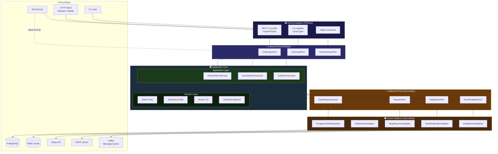
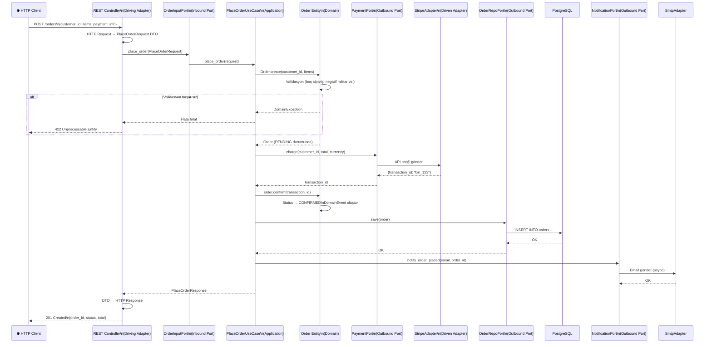
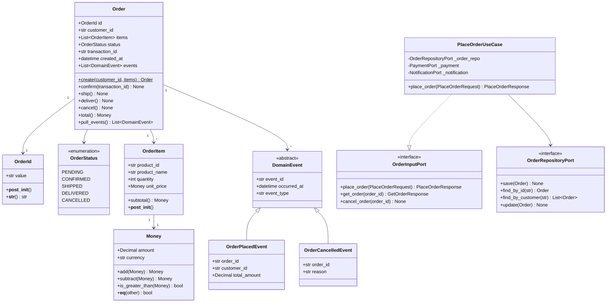
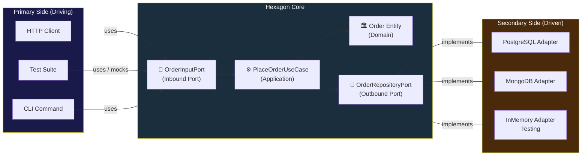
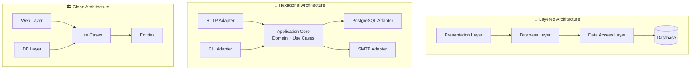

# 🔷 Hexagonal Architecture (Ports & Adapters)
### Kapsamlı Teknik Rehber

> *"The application should be equally driven by users, programs, automated tests or batch scripts, and be developed and tested in isolation from its eventual run-time devices and databases."*
>
> *"Uygulama, kullanıcılar, programlar, otomatik testler veya toplu iş komut dosyaları tarafından eşit derecede yönlendirilmeli ve nihai çalışma zamanı aygıtlarından ve veritabanlarından bağımsız olarak geliştirilip test edilmelidir."*
> 
> — Alistair Cockburn, 2005

---

## 📋 İçindekiler

- [Giriş: Neden Hexagonal Architecture?](#-giriş-neden-hexagonal-architecture)
- [Tarihsel Bağlam ve Motivasyon](#-tarihsel-bağlam-ve-motivasyon)
- [Temel Kavramlar](#-temel-kavramlar)
  - [Ports](#1-ports-portlar)
  - [Adapters](#2-adapters-adaptörler)
  - [Dependency Rule ve IoC](#3-dependency-rule-ve-inversion-of-control)
  - [Domain-Centric Yaklaşım](#4-domain-centric-yaklaşım)
- [Mimari Katmanlar](#-mimari-katmanlar)
- [Mimari Diyagramlar](#-mimari-diyagramlar)
- [Python ile Uçtan Uca Örnek](#-python-ile-uçtan-uca-örnek-sipariş-sistemi)
- [Klasör Yapısı](#-klasör-yapısı)
- [Test Stratejisi](#-test-stratejisi)
- [Karşılaştırmalar](#-karşılaştırmalar)
- [Avantajlar ve Dezavantajlar](#-avantajlar-ve-dezavantajlar)
- [Ne Zaman Kullanılmalı?](#-ne-zaman-kullanılmalı)
- [Best Practices ve Anti-Pattern'ler](#-best-practices-ve-anti-patternler)
- [Quick Start](#-quick-start)
- [Cheat Sheet](#-cheat-sheet)

---

##  Giriş: Neden Hexagonal Architecture?

### Geleneksel Katmanlı Mimarinin Sorunu

1990'lardan bu yana yaygın olan **Layered (N-Tier) Architecture**'da kod şöyle akar:

```
HTTP Request
     ↓
Presentation Layer  (Controllers, Views)
     ↓
Business Logic Layer (Services)
     ↓
Data Access Layer   (Repositories, ORMs)
     ↓
Database
```

Bu yaklaşım başlangıçta temiz görünür, ancak zamanla şu problemleri üretir:

| Problem | Açıklama |
|---------|----------|
| **Yukarıdan aşağı bağımlılık** | Her katman altındaki katmanı doğrudan import eder |
| **Veritabanı merkezlilik** | İş mantığı, DB şemasına göre şekillenir |
| **Test edilemezlik** | Birim testi için DB, HTTP stack'i gerekir |
| **Framework kilidi** | Framework değişimi, tüm uygulamayı etkiler |
| **Paralel geliştirme güçlüğü** | UI ve DB hazır olmadan iş mantığı test edilemez |

**Hexagonal Architecture bu sorunların tamamına tek bir cevap verir: Uygulamanın merkezini (Domain) her şeyden izole et.**

---

## 📖 Tarihsel Bağlam ve Motivasyon

**Alistair Cockburn**, 2005 yılında "Hexagonal Architecture" (ya da resmi adıyla "Ports and Adapters") pattern'ini yayımladı. Temel gözlemi şuydu:

> Bir uygulamanın hem insan hem de otomatik testler tarafından eşit kolaylıkla kullanılabilmesi gerekir. Ve uygulamanın gerçek çalışma zamanı ortamından (DB, UI, dış servisler) bağımsız olarak geliştirilip test edilebilmesi mümkün olmalıdır.

Altıgen (hexagon) şekli, gerçek bir anlam taşımaz — önemli olan kenar sayısı değil, her kenarın bir **port** (bağlantı noktası) temsil etmesidir. Uygulama; HTTP, CLI, mesaj kuyruğu, test runner gibi farklı kanallardan eşit rahatlıkla kullanılabilir.

---

## 🧠 Temel Kavramlar

### 1. Ports (Portlar)

**Port**, uygulamanın dış dünyayla konuştuğu sözleşmedir (interface/protokol). Port, *ne* yapılacağını tanımlar ama *nasıl* yapılacağını bilmez.

İki türü vardır:

#### Primary (Inbound / Driving) Ports — Giriş Portları

Uygulamayı **dışarıdan tetikleyen** arayüzler. Use Case interface'leri bu kategoriye girer. Dış dünya (kullanıcı, başka servis, test) bu port üzerinden uygulamayı kullanır.

```python
# application/ports/inbound/order_port.py
from abc import ABC, abstractmethod
from application.dtos.order_dtos import PlaceOrderRequest, PlaceOrderResponse, GetOrderResponse


class OrderInputPort(ABC):
    """
    Primary Port — Sipariş işlemlerini tetikleyen arayüz.
    HTTP controller, CLI veya test bu port üzerinden uygulamayı çalıştırır.
    """

    @abstractmethod
    def place_order(self, request: PlaceOrderRequest) -> PlaceOrderResponse:
        """Yeni sipariş oluştur."""
        pass

    @abstractmethod
    def get_order(self, order_id: str) -> GetOrderResponse:
        """Sipariş detayı getir."""
        pass

    @abstractmethod
    def cancel_order(self, order_id: str) -> None:
        """Siparişi iptal et."""
        pass
```

#### Secondary (Outbound / Driven) Ports — Çıkış Portları

Uygulamanın **dışarıya çağırdığı** arayüzler. Repository, notification, payment gibi dış bağımlılıklar için tanımlanan interface'ler bu kategoriye girer.

```python
# application/ports/outbound/order_repository_port.py
from abc import ABC, abstractmethod
from typing import Optional, List
from domain.entities.order import Order


class OrderRepositoryPort(ABC):
    """
    Secondary Port — Sipariş kalıcılığı için çıkış arayüzü.
    PostgreSQL, MongoDB veya InMemory ile implement edilebilir.
    """

    @abstractmethod
    def save(self, order: Order) -> None:
        pass

    @abstractmethod
    def find_by_id(self, order_id: str) -> Optional[Order]:
        pass

    @abstractmethod
    def find_by_customer(self, customer_id: str) -> List[Order]:
        pass

    @abstractmethod
    def update(self, order: Order) -> None:
        pass


# application/ports/outbound/notification_port.py
from abc import ABC, abstractmethod


class NotificationPort(ABC):
    """
    Secondary Port — Bildirim gönderimi için çıkış arayüzü.
    SMTP, SMS, Push Notification ile implement edilebilir.
    """

    @abstractmethod
    def notify_order_placed(self, customer_email: str, order_id: str) -> None:
        pass

    @abstractmethod
    def notify_order_cancelled(self, customer_email: str, order_id: str) -> None:
        pass


# application/ports/outbound/payment_port.py
from abc import ABC, abstractmethod
from decimal import Decimal


class PaymentPort(ABC):
    """Secondary Port — Ödeme işlemi için çıkış arayüzü."""

    @abstractmethod
    def charge(self, customer_id: str, amount: Decimal, currency: str) -> str:
        """Ödemeyi gerçekleştir; transaction_id döner."""
        pass

    @abstractmethod
    def refund(self, transaction_id: str, amount: Decimal) -> bool:
        pass
```

---

### 2. Adapters (Adaptörler)

**Adapter**, bir port'un somut implementasyonudur. Dış dünya ile port arasındaki çeviri işini üstlenir. İki türü vardır:

#### Primary (Driving) Adapters — Sürücü Adaptörler

Uygulamayı kullanan dış bileşenler. HTTP Controller, CLI komutları, test sınıfları bu kategoriye girer. Inbound port'u çağırırlar.

#### Secondary (Driven) Adapters — Sürülen Adaptörler

Uygulama tarafından kullanılan dış bileşenler. Veritabanı repository'leri, email gönderici sınıflar, ödeme gateway istemcileri bu kategoriye girer. Outbound port'u implement ederler.

```
┌─────────────────────────────────────────────────────────┐
│                                                         │
│  [HTTP Adapter] ──► [OrderInputPort] ──► [Use Case]    │
│  [CLI Adapter]  ──►                                     │
│  [Test Adapter] ──►       HEXAGON                       │
│                                                         │
│                    [Use Case] ──► [OrderRepoPort] ──►  [PostgresAdapter]  │
│                               ──► [NotifPort]    ──►  [SmtpAdapter]      │
│                               ──► [PaymentPort]  ──►  [StripeAdapter]    │
│                                                         │
└─────────────────────────────────────────────────────────┘
```

---

### 3. Dependency Rule ve Inversion of Control

#### Dependency Rule (Bağımlılık Kuralı)

Hexagonal Architecture'da **tüm bağımlılıklar içe doğrudur**:

```
Adapters → Ports → Domain
(Dış)       (Sınır)  (İç)
```

- `PostgresOrderRepository`, `OrderRepositoryPort`'u implement eder.
- `OrderRepositoryPort`, `Application` katmanında tanımlıdır.
- `Application`, `Domain`'i kullanır.
- `Domain` hiçbir şeyi import etmez.

Bu sayede Domain, PostgreSQL hakkında hiçbir şey bilmez. Yarın MongoDB'ye geçilirse Domain kodu tek satır değişmez.

#### Inversion of Control (IoC)

Geleneksel yaklaşımda Use Case, veritabanına doğrudan bağlanır:

```python
# ❌ Kontrolü Use Case elinde tutuyor
class PlaceOrderService:
    def __init__(self):
        self.db = PostgreSQLDatabase()  # Somut bağımlılık!
```

IoC ile bağımlılık dışarıdan enjekte edilir:

```python
# ✅ Kontrol dışarıda (DI Container veya composition root)
class PlaceOrderService:
    def __init__(self, order_repo: OrderRepositoryPort):  # Soyutlama!
        self._order_repo = order_repo
```

`PlaceOrderService` artık "ben repo kullanacağım ama hangisini bilemem" der. Hangisinin kullanılacağını **Composition Root** (uygulama başlangıç noktası) belirler.

---

### 4. Domain-Centric Yaklaşım

Hexagonal Architecture'ın merkezinde **Domain** bulunur. Bu yaklaşımın özü şudur:

- Tasarım, veritabanı şemasından değil **iş probleminden** başlar
- Entity'ler, ORM modellerine değil **iş kavramlarına** karşılık gelir
- Kodun en kararlı, en az değişen kısmı Domain'dir
- Test öncelikle Domain üzerinde yazılır

```
         Değişim Hızı (Yavaş → Hızlı)
         ←─────────────────────────────→
  Domain    Application    Adapters    External
  (Core)    (Use Cases)    (HTTP/DB)   (Framework)
  En az        Orta          Sık       En sık
  değişir     değişir      değişir     değişir
```

---

## 🏗️ Mimari Katmanlar

### Katman 1: Domain (Core)

**Sorumluluk:** İş kavramlarını ve kurallarını modeller. Hiçbir dış bağımlılık içermez.

**İçerir:**
- Entity'ler (iş nesneleri, kimliği olan kavramlar)
- Value Object'ler (kimliksiz, değerle tanımlanan kavramlar)
- Domain Event'ler (gerçekleşen olaylar)
- Domain Exception'lar (iş kuralı ihlalleri)
- Domain Service'ler (tek bir entity'e sığmayan iş mantığı)

**Bağımlılık:** **Hiçbir şeye bağımlı değildir.**

---

### Katman 2: Application (Use Cases)

**Sorumluluk:** İş senaryolarını orkestre eder. Domain nesnelerini kullanır, port'ları tanımlar.

**İçerir:**
- Use Case sınıfları (her senaryo için ayrı)
- Inbound Port interface'leri
- Outbound Port interface'leri
- DTO (Data Transfer Object) tanımları
- Application Service'ler

**Bağımlılık:** Yalnızca **Domain**'e bağımlıdır.

---

### Katman 3: Adapters (Birincil ve İkincil)

**Sorumluluk:** Dış dünya ile Application arasında çeviri yapar.

**Driving Adapters (Primary):**
- REST Controller
- GraphQL Resolver
- CLI Command Handler
- Message Queue Consumer
- Test Doubles

**Driven Adapters (Secondary):**
- SQL/NoSQL Repository implementasyonları
- Email/SMS gönderici sınıflar
- Dış API istemcileri
- Cache implementasyonları

**Bağımlılık:** **Application** katmanındaki port'lara bağımlıdır.

---

### Katman 4: Infrastructure / Configuration

**Sorumluluk:** Framework konfigürasyonu, Dependency Injection Container, uygulama bootstrapping.

**İçerir:**
- DI Container / Composition Root
- Framework ayarları (Flask, FastAPI config)
- Database migration dosyaları
- Logging/Monitoring kurulumu

**Bağımlılık:** Her şeyi bilir ama yalnızca bağlar — iş mantığı içermez.

---

## 📊 Mimari Diyagramlar

### Genel Mimari — Hexagon Şeması



---

### Sequence Diagram — Sipariş Verme Akışı



---

### Class Diagram — Domain Modeli



---

### Port-Adapter Bağlantı Diyagramı



---

## 🐍 Python ile Uçtan Uca Örnek: Sipariş Sistemi

### Domain Katmanı

```python
# domain/value_objects.py
from __future__ import annotations
from dataclasses import dataclass
from decimal import Decimal
import re
import uuid


@dataclass(frozen=True)
class OrderId:
    value: str = ""

    def __post_init__(self):
        if not self.value:
            object.__setattr__(self, "value", str(uuid.uuid4()))

    def __str__(self) -> str:
        return self.value

    @classmethod
    def from_string(cls, value: str) -> "OrderId":
        return cls(value=value)


@dataclass(frozen=True)
class Money:
    amount: Decimal
    currency: str = "TRY"

    def __post_init__(self):
        if self.amount < Decimal("0"):
            raise ValueError(f"Para miktarı negatif olamaz: {self.amount}")
        if len(self.currency) != 3:
            raise ValueError(f"Geçersiz para birimi: {self.currency}")

    def add(self, other: "Money") -> "Money":
        self._assert_same_currency(other)
        return Money(self.amount + other.amount, self.currency)

    def subtract(self, other: "Money") -> "Money":
        self._assert_same_currency(other)
        result = self.amount - other.amount
        if result < Decimal("0"):
            raise ValueError("Sonuç negatif olamaz")
        return Money(result, self.currency)

    def multiply(self, factor: int) -> "Money":
        return Money(self.amount * Decimal(str(factor)), self.currency)

    def is_greater_than(self, other: "Money") -> bool:
        self._assert_same_currency(other)
        return self.amount > other.amount

    def _assert_same_currency(self, other: "Money") -> None:
        if self.currency != other.currency:
            raise ValueError(
                f"Para birimleri eşleşmiyor: {self.currency} vs {other.currency}"
            )

    def __repr__(self) -> str:
        return f"{self.amount:.2f} {self.currency}"
```

```python
# domain/events.py
from dataclasses import dataclass, field
from datetime import datetime
from decimal import Decimal
import uuid


@dataclass
class DomainEvent:
    event_id: str = field(default_factory=lambda: str(uuid.uuid4()))
    occurred_at: datetime = field(default_factory=datetime.utcnow)

    @property
    def event_type(self) -> str:
        return self.__class__.__name__


@dataclass
class OrderPlacedEvent(DomainEvent):
    order_id: str = ""
    customer_id: str = ""
    total_amount: Decimal = Decimal("0")
    currency: str = "TRY"


@dataclass
class OrderConfirmedEvent(DomainEvent):
    order_id: str = ""
    transaction_id: str = ""


@dataclass
class OrderCancelledEvent(DomainEvent):
    order_id: str = ""
    customer_id: str = ""
    reason: str = ""
```

```python
# domain/exceptions.py


class DomainException(Exception):
    """Tüm domain exception'larının tabanı."""
    pass


class EmptyOrderException(DomainException):
    def __init__(self):
        super().__init__("Sipariş en az bir ürün içermelidir.")


class InvalidQuantityException(DomainException):
    def __init__(self, quantity: int):
        super().__init__(f"Ürün miktarı pozitif olmalıdır, alınan: {quantity}")


class OrderAlreadyConfirmedException(DomainException):
    def __init__(self, order_id: str):
        super().__init__(f"Sipariş zaten onaylanmış: {order_id}")


class CannotCancelDeliveredOrderException(DomainException):
    def __init__(self, order_id: str):
        super().__init__(f"Teslim edilmiş sipariş iptal edilemez: {order_id}")


class OrderNotFoundException(DomainException):
    def __init__(self, order_id: str):
        super().__init__(f"Sipariş bulunamadı: {order_id}")
```

```python
# domain/entities/order.py
from __future__ import annotations
from dataclasses import dataclass, field
from datetime import datetime
from enum import Enum
from typing import List, Optional
from domain.value_objects import OrderId, Money
from domain.events import (
    DomainEvent, OrderPlacedEvent, OrderConfirmedEvent, OrderCancelledEvent
)
from domain.exceptions import (
    EmptyOrderException, InvalidQuantityException,
    OrderAlreadyConfirmedException, CannotCancelDeliveredOrderException,
)


class OrderStatus(Enum):
    PENDING = "pending"
    CONFIRMED = "confirmed"
    SHIPPED = "shipped"
    DELIVERED = "delivered"
    CANCELLED = "cancelled"


@dataclass
class OrderItem:
    product_id: str
    product_name: str
    quantity: int
    unit_price: Money

    def __post_init__(self):
        if self.quantity <= 0:
            raise InvalidQuantityException(self.quantity)

    @property
    def subtotal(self) -> Money:
        return self.unit_price.multiply(self.quantity)


@dataclass
class Order:
    id: OrderId
    customer_id: str
    items: List[OrderItem]
    status: OrderStatus
    created_at: datetime
    transaction_id: Optional[str] = None
    _events: List[DomainEvent] = field(default_factory=list, repr=False)

    @classmethod
    def create(cls, customer_id: str, items: List[OrderItem]) -> "Order":
        """
        Factory method — geçerli bir sipariş oluşturur.
        İş kuralı: Boş sipariş oluşturulamaz.
        """
        if not items:
            raise EmptyOrderException()

        order = cls(
            id=OrderId(),
            customer_id=customer_id,
            items=items,
            status=OrderStatus.PENDING,
            created_at=datetime.utcnow(),
        )

        # Domain event kaydet
        order._events.append(
            OrderPlacedEvent(
                order_id=str(order.id),
                customer_id=customer_id,
                total_amount=order.total.amount,
                currency=order.total.currency,
            )
        )

        return order

    def confirm(self, transaction_id: str) -> None:
        """
        İş kuralı: Yalnızca PENDING durumundaki sipariş onaylanabilir.
        """
        if self.status != OrderStatus.PENDING:
            raise OrderAlreadyConfirmedException(str(self.id))

        self.status = OrderStatus.CONFIRMED
        self.transaction_id = transaction_id

        self._events.append(
            OrderConfirmedEvent(
                order_id=str(self.id),
                transaction_id=transaction_id,
            )
        )

    def ship(self) -> None:
        if self.status != OrderStatus.CONFIRMED:
            raise DomainException("Yalnızca onaylanmış sipariş kargoya verilebilir.")
        self.status = OrderStatus.SHIPPED

    def deliver(self) -> None:
        if self.status != OrderStatus.SHIPPED:
            raise DomainException("Yalnızca kargodaki sipariş teslim edilebilir.")
        self.status = OrderStatus.DELIVERED

    def cancel(self, reason: str = "") -> None:
        """
        İş kuralı: Teslim edilmiş sipariş iptal edilemez.
        """
        if self.status == OrderStatus.DELIVERED:
            raise CannotCancelDeliveredOrderException(str(self.id))

        self.status = OrderStatus.CANCELLED
        self._events.append(
            OrderCancelledEvent(
                order_id=str(self.id),
                customer_id=self.customer_id,
                reason=reason,
            )
        )

    @property
    def total(self) -> Money:
        if not self.items:
            return Money(amount=__import__("decimal").Decimal("0"))
        result = self.items[0].subtotal
        for item in self.items[1:]:
            result = result.add(item.subtotal)
        return result

    def pull_events(self) -> List[DomainEvent]:
        """
        Domain event'leri tüket. Bir kez okunur ve temizlenir.
        """
        events = list(self._events)
        self._events.clear()
        return events
```

---

### Application Katmanı — Ports ve Use Cases

```python
# application/dtos/order_dtos.py
from dataclasses import dataclass
from decimal import Decimal
from typing import List


@dataclass
class OrderItemRequest:
    product_id: str
    product_name: str
    quantity: int
    unit_price: float


@dataclass
class PlaceOrderRequest:
    customer_id: str
    customer_email: str
    items: List[OrderItemRequest]
    currency: str = "TRY"


@dataclass
class OrderItemResponse:
    product_id: str
    product_name: str
    quantity: int
    unit_price: float
    subtotal: float


@dataclass
class PlaceOrderResponse:
    order_id: str
    status: str
    total_amount: float
    currency: str
    message: str


@dataclass
class GetOrderResponse:
    order_id: str
    customer_id: str
    status: str
    items: List[OrderItemResponse]
    total_amount: float
    currency: str
    transaction_id: str | None
```

```python
# application/ports/inbound/order_input_port.py
from abc import ABC, abstractmethod
from application.dtos.order_dtos import (
    PlaceOrderRequest, PlaceOrderResponse, GetOrderResponse
)


class OrderInputPort(ABC):
    """Primary (Inbound) Port — Sipariş işlemleri için giriş arayüzü."""

    @abstractmethod
    def place_order(self, request: PlaceOrderRequest) -> PlaceOrderResponse:
        pass

    @abstractmethod
    def get_order(self, order_id: str) -> GetOrderResponse:
        pass

    @abstractmethod
    def cancel_order(self, order_id: str, reason: str = "") -> None:
        pass
```

```python
# application/ports/outbound/order_repository_port.py
from abc import ABC, abstractmethod
from typing import Optional, List
from domain.entities.order import Order


class OrderRepositoryPort(ABC):
    """Secondary (Outbound) Port — Sipariş kalıcılığı."""

    @abstractmethod
    def save(self, order: Order) -> None:
        pass

    @abstractmethod
    def find_by_id(self, order_id: str) -> Optional[Order]:
        pass

    @abstractmethod
    def find_by_customer(self, customer_id: str) -> List[Order]:
        pass

    @abstractmethod
    def update(self, order: Order) -> None:
        pass
```

```python
# application/ports/outbound/payment_port.py
from abc import ABC, abstractmethod
from decimal import Decimal


class PaymentPort(ABC):
    """Secondary (Outbound) Port — Ödeme işlemleri."""

    @abstractmethod
    def charge(
        self,
        customer_id: str,
        amount: Decimal,
        currency: str,
    ) -> str:
        """Ödeme tahsil eder; transaction_id döner."""
        pass

    @abstractmethod
    def refund(self, transaction_id: str, amount: Decimal) -> bool:
        pass
```

```python
# application/ports/outbound/notification_port.py
from abc import ABC, abstractmethod


class NotificationPort(ABC):
    """Secondary (Outbound) Port — Kullanıcı bildirimleri."""

    @abstractmethod
    def notify_order_placed(self, customer_email: str, order_id: str, total: str) -> None:
        pass

    @abstractmethod
    def notify_order_cancelled(self, customer_email: str, order_id: str) -> None:
        pass
```

```python
# application/ports/outbound/event_publisher_port.py
from abc import ABC, abstractmethod
from domain.events import DomainEvent


class EventPublisherPort(ABC):
    """Secondary (Outbound) Port — Domain event yayıncısı."""

    @abstractmethod
    def publish(self, event: DomainEvent) -> None:
        pass
```

```python
# application/use_cases/place_order_use_case.py
from decimal import Decimal
from application.ports.inbound.order_input_port import OrderInputPort
from application.ports.outbound.order_repository_port import OrderRepositoryPort
from application.ports.outbound.payment_port import PaymentPort
from application.ports.outbound.notification_port import NotificationPort
from application.ports.outbound.event_publisher_port import EventPublisherPort
from application.dtos.order_dtos import (
    PlaceOrderRequest, PlaceOrderResponse,
    GetOrderResponse, OrderItemResponse,
)
from domain.entities.order import Order, OrderItem
from domain.value_objects import Money
from domain.exceptions import OrderNotFoundException


class PlaceOrderUseCase(OrderInputPort):
    """
    Primary Port'u implement eden Use Case.
    Domain nesnelerini orkestre eder; iş mantığını bilmez,
    Domain'in iş mantığını çalıştırır.
    """

    def __init__(
        self,
        order_repository: OrderRepositoryPort,
        payment: PaymentPort,
        notification: NotificationPort,
        event_publisher: EventPublisherPort,
    ):
        self._order_repo = order_repository
        self._payment = payment
        self._notification = notification
        self._event_publisher = event_publisher

    def place_order(self, request: PlaceOrderRequest) -> PlaceOrderResponse:
        # 1. Domain nesnesi oluştur (validasyon Domain içinde gerçekleşir)
        items = [
            OrderItem(
                product_id=item.product_id,
                product_name=item.product_name,
                quantity=item.quantity,
                unit_price=Money(
                    amount=Decimal(str(item.unit_price)),
                    currency=request.currency,
                ),
            )
            for item in request.items
        ]

        order = Order.create(
            customer_id=request.customer_id,
            items=items,
        )

        # 2. Ödemeyi tahsil et (Secondary Port üzerinden)
        transaction_id = self._payment.charge(
            customer_id=request.customer_id,
            amount=order.total.amount,
            currency=order.total.currency,
        )

        # 3. Siparişi onayla (iş kuralı Domain'de)
        order.confirm(transaction_id=transaction_id)

        # 4. Kaydet (Secondary Port üzerinden)
        self._order_repo.save(order)

        # 5. Domain event'leri yayımla
        for event in order.pull_events():
            self._event_publisher.publish(event)

        # 6. Bildirim gönder (Secondary Port üzerinden)
        self._notification.notify_order_placed(
            customer_email=request.customer_email,
            order_id=str(order.id),
            total=str(order.total),
        )

        return PlaceOrderResponse(
            order_id=str(order.id),
            status=order.status.value,
            total_amount=float(order.total.amount),
            currency=order.total.currency,
            message="Sipariş başarıyla oluşturuldu.",
        )

    def get_order(self, order_id: str) -> GetOrderResponse:
        order = self._order_repo.find_by_id(order_id)
        if not order:
            raise OrderNotFoundException(order_id)

        return GetOrderResponse(
            order_id=str(order.id),
            customer_id=order.customer_id,
            status=order.status.value,
            items=[
                OrderItemResponse(
                    product_id=item.product_id,
                    product_name=item.product_name,
                    quantity=item.quantity,
                    unit_price=float(item.unit_price.amount),
                    subtotal=float(item.subtotal.amount),
                )
                for item in order.items
            ],
            total_amount=float(order.total.amount),
            currency=order.total.currency,
            transaction_id=order.transaction_id,
        )

    def cancel_order(self, order_id: str, reason: str = "") -> None:
        order = self._order_repo.find_by_id(order_id)
        if not order:
            raise OrderNotFoundException(order_id)

        order.cancel(reason=reason)
        self._order_repo.update(order)

        for event in order.pull_events():
            self._event_publisher.publish(event)
```

---

### Driving Adapter — REST Controller

```python
# adapters/driving/http/order_controller.py
from flask import Blueprint, request, jsonify, Response
from application.ports.inbound.order_input_port import OrderInputPort
from application.dtos.order_dtos import PlaceOrderRequest, OrderItemRequest
from domain.exceptions import (
    DomainException, OrderNotFoundException, EmptyOrderException
)

order_bp = Blueprint("orders", __name__, url_prefix="/api/v1/orders")


class OrderController:
    """
    Driving Adapter — HTTP isteklerini Inbound Port çağrılarına dönüştürür.
    Flask'a bağımlıdır ama iş mantığından habersizdir.
    """

    def __init__(self, order_port: OrderInputPort):
        self._port = order_port

    def place_order(self) -> Response:
        data = request.get_json(force=True)

        # HTTP veri → DTO dönüşümü (Adapter sorumluluğu)
        try:
            place_request = PlaceOrderRequest(
                customer_id=data["customer_id"],
                customer_email=data["customer_email"],
                currency=data.get("currency", "TRY"),
                items=[
                    OrderItemRequest(
                        product_id=item["product_id"],
                        product_name=item["product_name"],
                        quantity=item["quantity"],
                        unit_price=item["unit_price"],
                    )
                    for item in data.get("items", [])
                ],
            )
        except (KeyError, TypeError) as e:
            return jsonify({"error": f"Geçersiz istek formatı: {str(e)}"}), 400

        try:
            response = self._port.place_order(place_request)
            return jsonify({
                "order_id": response.order_id,
                "status": response.status,
                "total_amount": response.total_amount,
                "currency": response.currency,
                "message": response.message,
            }), 201

        except EmptyOrderException as e:
            return jsonify({"error": str(e)}), 422
        except DomainException as e:
            return jsonify({"error": str(e)}), 400
        except Exception as e:
            return jsonify({"error": "Sunucu hatası"}), 500

    def get_order(self, order_id: str) -> Response:
        try:
            response = self._port.get_order(order_id)
            return jsonify({
                "order_id": response.order_id,
                "customer_id": response.customer_id,
                "status": response.status,
                "items": [
                    {
                        "product_id": item.product_id,
                        "product_name": item.product_name,
                        "quantity": item.quantity,
                        "unit_price": item.unit_price,
                        "subtotal": item.subtotal,
                    }
                    for item in response.items
                ],
                "total_amount": response.total_amount,
                "currency": response.currency,
                "transaction_id": response.transaction_id,
            }), 200

        except OrderNotFoundException as e:
            return jsonify({"error": str(e)}), 404

    def cancel_order(self, order_id: str) -> Response:
        data = request.get_json(force=True) or {}
        reason = data.get("reason", "")

        try:
            self._port.cancel_order(order_id, reason)
            return jsonify({"message": "Sipariş iptal edildi."}), 200
        except OrderNotFoundException as e:
            return jsonify({"error": str(e)}), 404
        except DomainException as e:
            return jsonify({"error": str(e)}), 400


def register_routes(app, order_controller: OrderController):
    app.add_url_rule(
        "/api/v1/orders",
        view_func=order_controller.place_order,
        methods=["POST"],
    )
    app.add_url_rule(
        "/api/v1/orders/<order_id>",
        view_func=order_controller.get_order,
        methods=["GET"],
    )
    app.add_url_rule(
        "/api/v1/orders/<order_id>/cancel",
        view_func=order_controller.cancel_order,
        methods=["POST"],
    )
```

---

### Driven Adapters — Repository ve Dış Servisler

```python
# adapters/driven/persistence/postgres_order_repository.py
from typing import Optional, List
from decimal import Decimal
import json
import psycopg2
from application.ports.outbound.order_repository_port import OrderRepositoryPort
from domain.entities.order import Order, OrderItem, OrderStatus
from domain.value_objects import OrderId, Money


class PostgresOrderRepository(OrderRepositoryPort):
    """
    Driven Adapter — OrderRepositoryPort'un PostgreSQL implementasyonu.
    Veritabanı detaylarını bilir; Domain'i bilmez — sadece dönüştürür.
    """

    def __init__(self, connection_string: str):
        self._conn = psycopg2.connect(connection_string)

    def save(self, order: Order) -> None:
        with self._conn.cursor() as cur:
            cur.execute(
                """
                INSERT INTO orders (id, customer_id, status, transaction_id, created_at)
                VALUES (%s, %s, %s, %s, %s)
                """,
                (
                    str(order.id),
                    order.customer_id,
                    order.status.value,
                    order.transaction_id,
                    order.created_at,
                ),
            )
            for item in order.items:
                cur.execute(
                    """
                    INSERT INTO order_items
                        (order_id, product_id, product_name, quantity, unit_price, currency)
                    VALUES (%s, %s, %s, %s, %s, %s)
                    """,
                    (
                        str(order.id),
                        item.product_id,
                        item.product_name,
                        item.quantity,
                        str(item.unit_price.amount),
                        item.unit_price.currency,
                    ),
                )
        self._conn.commit()

    def find_by_id(self, order_id: str) -> Optional[Order]:
        with self._conn.cursor() as cur:
            cur.execute(
                "SELECT id, customer_id, status, transaction_id, created_at "
                "FROM orders WHERE id = %s",
                (order_id,),
            )
            row = cur.fetchone()
            if not row:
                return None

            cur.execute(
                "SELECT product_id, product_name, quantity, unit_price, currency "
                "FROM order_items WHERE order_id = %s",
                (order_id,),
            )
            item_rows = cur.fetchall()

        items = [
            OrderItem(
                product_id=r[0],
                product_name=r[1],
                quantity=r[2],
                unit_price=Money(amount=Decimal(r[3]), currency=r[4]),
            )
            for r in item_rows
        ]

        return Order(
            id=OrderId.from_string(row[0]),
            customer_id=row[1],
            status=OrderStatus(row[2]),
            transaction_id=row[3],
            created_at=row[4],
            items=items,
        )

    def find_by_customer(self, customer_id: str) -> List[Order]:
        with self._conn.cursor() as cur:
            cur.execute(
                "SELECT id FROM orders WHERE customer_id = %s",
                (customer_id,),
            )
            order_ids = [row[0] for row in cur.fetchall()]
        return [self.find_by_id(oid) for oid in order_ids if self.find_by_id(oid)]

    def update(self, order: Order) -> None:
        with self._conn.cursor() as cur:
            cur.execute(
                "UPDATE orders SET status = %s, transaction_id = %s WHERE id = %s",
                (order.status.value, order.transaction_id, str(order.id)),
            )
        self._conn.commit()
```

```python
# adapters/driven/payment/stripe_payment_adapter.py
from decimal import Decimal
from application.ports.outbound.payment_port import PaymentPort
import stripe  # pip install stripe


class StripePaymentAdapter(PaymentPort):
    """
    Driven Adapter — PaymentPort'un Stripe implementasyonu.
    Yarın başka bir ödeme sağlayıcısına geçmek için yalnızca
    bu sınıfı değiştirmek yeterlidir.
    """

    def __init__(self, api_key: str):
        stripe.api_key = api_key

    def charge(self, customer_id: str, amount: Decimal, currency: str) -> str:
        charge = stripe.PaymentIntent.create(
            amount=int(amount * 100),  # Kuruş cinsinden
            currency=currency.lower(),
            customer=customer_id,
            confirm=True,
            payment_method="pm_card_visa",  # Test için
        )
        return charge["id"]

    def refund(self, transaction_id: str, amount: Decimal) -> bool:
        try:
            stripe.Refund.create(
                payment_intent=transaction_id,
                amount=int(amount * 100),
            )
            return True
        except stripe.error.StripeError:
            return False
```

```python
# adapters/driven/notification/smtp_notification_adapter.py
import smtplib
from email.mime.text import MIMEText
from application.ports.outbound.notification_port import NotificationPort


class SmtpNotificationAdapter(NotificationPort):
    """Driven Adapter — NotificationPort'un SMTP implementasyonu."""

    def __init__(self, host: str, port: int, username: str, password: str):
        self._host = host
        self._port = port
        self._username = username
        self._password = password

    def notify_order_placed(self, customer_email: str, order_id: str, total: str) -> None:
        self._send(
            to=customer_email,
            subject=f"Siparişiniz Alındı — #{order_id[:8].upper()}",
            body=f"Siparişiniz başarıyla oluşturuldu.\nToplam: {total}",
        )

    def notify_order_cancelled(self, customer_email: str, order_id: str) -> None:
        self._send(
            to=customer_email,
            subject=f"Sipariş İptal Edildi — #{order_id[:8].upper()}",
            body="Siparişiniz iptal edildi.",
        )

    def _send(self, to: str, subject: str, body: str) -> None:
        msg = MIMEText(body, "plain", "utf-8")
        msg["Subject"] = subject
        msg["From"] = self._username
        msg["To"] = to

        with smtplib.SMTP(self._host, self._port) as server:
            server.starttls()
            server.login(self._username, self._password)
            server.send_message(msg)
```

```python
# adapters/driven/events/kafka_event_publisher.py
import json
from application.ports.outbound.event_publisher_port import EventPublisherPort
from domain.events import DomainEvent
from kafka import KafkaProducer  # pip install kafka-python


class KafkaEventPublisher(EventPublisherPort):
    """Driven Adapter — EventPublisherPort'un Kafka implementasyonu."""

    def __init__(self, bootstrap_servers: str):
        self._producer = KafkaProducer(
            bootstrap_servers=bootstrap_servers,
            value_serializer=lambda v: json.dumps(v).encode("utf-8"),
        )

    def publish(self, event: DomainEvent) -> None:
        topic = f"domain.{event.event_type.lower()}"
        self._producer.send(topic, {
            "event_id": event.event_id,
            "event_type": event.event_type,
            "occurred_at": event.occurred_at.isoformat(),
            **self._serialize_event(event),
        })
        self._producer.flush()

    def _serialize_event(self, event: DomainEvent) -> dict:
        from domain.events import OrderPlacedEvent, OrderCancelledEvent
        if isinstance(event, OrderPlacedEvent):
            return {
                "order_id": event.order_id,
                "customer_id": event.customer_id,
                "total_amount": str(event.total_amount),
            }
        if isinstance(event, OrderCancelledEvent):
            return {
                "order_id": event.order_id,
                "customer_id": event.customer_id,
                "reason": event.reason,
            }
        return {}
```

---

### Composition Root — Dependency Injection

```python
# infrastructure/container.py
import os
from adapters.driven.persistence.postgres_order_repository import PostgresOrderRepository
from adapters.driven.payment.stripe_payment_adapter import StripePaymentAdapter
from adapters.driven.notification.smtp_notification_adapter import SmtpNotificationAdapter
from adapters.driven.events.kafka_event_publisher import KafkaEventPublisher
from application.use_cases.place_order_use_case import PlaceOrderUseCase
from adapters.driving.http.order_controller import OrderController


class Container:
    """
    Composition Root — Tüm bağımlılıkları bir noktada birleştirir.
    Bu sınıf iş mantığı içermez; sadece "kablo bağlantısı" yapar.
    """

    def __init__(self):
        # Driven Adapters
        self._order_repo = PostgresOrderRepository(
            connection_string=os.environ["DATABASE_URL"]
        )
        self._payment = StripePaymentAdapter(
            api_key=os.environ["STRIPE_API_KEY"]
        )
        self._notification = SmtpNotificationAdapter(
            host=os.environ["SMTP_HOST"],
            port=int(os.environ["SMTP_PORT"]),
            username=os.environ["SMTP_USERNAME"],
            password=os.environ["SMTP_PASSWORD"],
        )
        self._event_publisher = KafkaEventPublisher(
            bootstrap_servers=os.environ["KAFKA_BROKERS"]
        )

        # Use Cases (Primary Port implementasyonları)
        self.place_order_use_case = PlaceOrderUseCase(
            order_repository=self._order_repo,
            payment=self._payment,
            notification=self._notification,
            event_publisher=self._event_publisher,
        )

        # Driving Adapters
        self.order_controller = OrderController(
            order_port=self.place_order_use_case
        )


# main.py
from flask import Flask
from infrastructure.container import Container
from adapters.driving.http.order_controller import register_routes


def create_app() -> Flask:
    app = Flask(__name__)
    container = Container()
    register_routes(app, container.order_controller)
    return app


if __name__ == "__main__":
    app = create_app()
    app.run(debug=False, port=8080)
```

---

## 📁 Klasör Yapısı

```
hexagonal_order_service/
│
├── 📂 domain/                              # 🏛️ Core — Hiçbir şeye bağımlı değil
│   ├── __init__.py
│   ├── entities/
│   │   ├── __init__.py
│   │   └── order.py                        # Order, OrderItem, OrderStatus
│   ├── value_objects.py                    # OrderId, Money
│   ├── events.py                           # DomainEvent, OrderPlacedEvent vs.
│   └── exceptions.py                       # DomainException alt sınıfları
│
├── 📂 application/                         # ⚙️ Use Cases — Yalnızca Domain'e bağımlı
│   ├── __init__.py
│   ├── dtos/
│   │   ├── __init__.py
│   │   └── order_dtos.py                   # Request/Response DTO'ları
│   ├── ports/
│   │   ├── inbound/
│   │   │   ├── __init__.py
│   │   │   └── order_input_port.py         # Primary Port (ABC)
│   │   └── outbound/
│   │       ├── __init__.py
│   │       ├── order_repository_port.py    # Secondary Port (ABC)
│   │       ├── payment_port.py             # Secondary Port (ABC)
│   │       ├── notification_port.py        # Secondary Port (ABC)
│   │       └── event_publisher_port.py     # Secondary Port (ABC)
│   └── use_cases/
│       ├── __init__.py
│       └── place_order_use_case.py         # OrderInputPort implementasyonu
│
├── 📂 adapters/                            # 🔌 Adaptörler — Port'lara bağımlı
│   ├── driving/                            # Primary (Driving) Adapters
│   │   ├── http/
│   │   │   └── order_controller.py         # Flask/FastAPI controller
│   │   ├── cli/
│   │   │   └── order_commands.py           # Click CLI komutları
│   │   └── consumers/
│   │       └── kafka_order_consumer.py     # Kafka consumer
│   └── driven/                             # Secondary (Driven) Adapters
│       ├── persistence/
│       │   └── postgres_order_repository.py
│       ├── payment/
│       │   └── stripe_payment_adapter.py
│       ├── notification/
│       │   └── smtp_notification_adapter.py
│       ├── events/
│       │   └── kafka_event_publisher.py
│       └── cache/
│           └── redis_cache_adapter.py
│
├── 📂 infrastructure/                      # 🔧 Framework & Config
│   ├── __init__.py
│   ├── container.py                        # Composition Root / DI Container
│   ├── settings.py                         # Ortam değişkenleri, Pydantic Settings
│   └── migrations/                         # Alembic DB migration'ları
│       └── versions/
│
├── 📂 tests/
│   ├── unit/
│   │   ├── domain/                         # Saf domain testleri (mock yok)
│   │   │   ├── test_order_entity.py
│   │   │   └── test_money_value_object.py
│   │   └── use_cases/                      # Mock port'larla use case testleri
│   │       └── test_place_order_use_case.py
│   ├── integration/
│   │   └── adapters/                       # Gerçek altyapıyla adapter testleri
│   │       └── test_postgres_repository.py
│   └── e2e/
│       └── test_order_api.py               # HTTP endpoint testleri
│
├── main.py
├── requirements.txt
├── docker-compose.yml
├── Dockerfile
└── README.md
```

---

## 🧪 Test Stratejisi

Hexagonal Architecture'ın en güçlü tarafı katmanlı test stratejisidir.

### Birim Testler — Domain (Altyapısız)

```python
# tests/unit/domain/test_order_entity.py
import pytest
from decimal import Decimal
from domain.entities.order import Order, OrderItem, OrderStatus
from domain.value_objects import Money
from domain.exceptions import (
    EmptyOrderException, CannotCancelDeliveredOrderException,
    OrderAlreadyConfirmedException,
)


def make_item(quantity=1, price="100.00", currency="TRY") -> OrderItem:
    return OrderItem(
        product_id="prod-1",
        product_name="Test Ürün",
        quantity=quantity,
        unit_price=Money(Decimal(price), currency),
    )


class TestOrderCreation:
    def test_creates_order_successfully(self):
        order = Order.create("customer-1", [make_item()])
        assert order.status == OrderStatus.PENDING
        assert order.customer_id == "customer-1"

    def test_raises_exception_for_empty_order(self):
        with pytest.raises(EmptyOrderException):
            Order.create("customer-1", [])

    def test_emits_order_placed_event(self):
        order = Order.create("customer-1", [make_item()])
        events = order.pull_events()
        assert len(events) == 1
        assert events[0].event_type == "OrderPlacedEvent"

    def test_calculates_total_correctly(self):
        items = [make_item(quantity=2, price="50.00"), make_item(quantity=3, price="30.00")]
        order = Order.create("customer-1", items)
        assert order.total.amount == Decimal("190.00")


class TestOrderConfirmation:
    def test_confirms_pending_order(self):
        order = Order.create("customer-1", [make_item()])
        order.confirm("txn-123")
        assert order.status == OrderStatus.CONFIRMED
        assert order.transaction_id == "txn-123"

    def test_cannot_confirm_already_confirmed_order(self):
        order = Order.create("customer-1", [make_item()])
        order.confirm("txn-1")
        with pytest.raises(OrderAlreadyConfirmedException):
            order.confirm("txn-2")


class TestOrderCancellation:
    def test_can_cancel_pending_order(self):
        order = Order.create("customer-1", [make_item()])
        order.cancel("Fikir değişti")
        assert order.status == OrderStatus.CANCELLED

    def test_cannot_cancel_delivered_order(self):
        order = Order.create("customer-1", [make_item()])
        order.status = OrderStatus.DELIVERED
        with pytest.raises(CannotCancelDeliveredOrderException):
            order.cancel()
```

---

### Birim Testler — Use Case (Mock Port'larla)

```python
# tests/unit/use_cases/test_place_order_use_case.py
import pytest
from decimal import Decimal
from unittest.mock import MagicMock, call
from application.use_cases.place_order_use_case import PlaceOrderUseCase
from application.dtos.order_dtos import PlaceOrderRequest, OrderItemRequest
from domain.exceptions import EmptyOrderException


@pytest.fixture
def mock_ports():
    return {
        "order_repository": MagicMock(),
        "payment": MagicMock(),
        "notification": MagicMock(),
        "event_publisher": MagicMock(),
    }


@pytest.fixture
def use_case(mock_ports):
    return PlaceOrderUseCase(**mock_ports)


class TestPlaceOrderUseCase:
    def test_places_order_successfully(self, use_case, mock_ports):
        # Arrange
        mock_ports["payment"].charge.return_value = "txn-abc-123"

        request = PlaceOrderRequest(
            customer_id="cust-1",
            customer_email="test@example.com",
            items=[
                OrderItemRequest("prod-1", "Laptop", 1, 15000.00),
                OrderItemRequest("prod-2", "Mouse", 2, 250.00),
            ],
        )

        # Act
        response = use_case.place_order(request)

        # Assert
        assert response.status == "confirmed"
        assert response.total_amount == pytest.approx(15500.00)
        mock_ports["order_repository"].save.assert_called_once()
        mock_ports["notification"].notify_order_placed.assert_called_once_with(
            customer_email="test@example.com",
            order_id=response.order_id,
            total=mock_ports["notification"].notify_order_placed.call_args[1]["total"],
        )
        mock_ports["event_publisher"].publish.assert_called()

    def test_does_not_save_if_payment_fails(self, use_case, mock_ports):
        # Arrange
        mock_ports["payment"].charge.side_effect = Exception("Ödeme reddedildi")

        request = PlaceOrderRequest(
            customer_id="cust-1",
            customer_email="test@example.com",
            items=[OrderItemRequest("prod-1", "Ürün", 1, 100.0)],
        )

        # Act & Assert
        with pytest.raises(Exception, match="Ödeme reddedildi"):
            use_case.place_order(request)

        mock_ports["order_repository"].save.assert_not_called()

    def test_raises_for_empty_items(self, use_case, mock_ports):
        request = PlaceOrderRequest(
            customer_id="cust-1",
            customer_email="test@example.com",
            items=[],
        )

        with pytest.raises(EmptyOrderException):
            use_case.place_order(request)
```

---

### Test Double — InMemory Adapter

```python
# tests/fakes/in_memory_order_repository.py
from typing import Optional, List, Dict
from application.ports.outbound.order_repository_port import OrderRepositoryPort
from domain.entities.order import Order


class InMemoryOrderRepository(OrderRepositoryPort):
    """
    Test ve geliştirme ortamı için bellek içi repository.
    Gerçek DB olmadan use case'leri çalıştırmaya imkân tanır.
    """

    def __init__(self):
        self._store: Dict[str, Order] = {}

    def save(self, order: Order) -> None:
        self._store[str(order.id)] = order

    def find_by_id(self, order_id: str) -> Optional[Order]:
        return self._store.get(order_id)

    def find_by_customer(self, customer_id: str) -> List[Order]:
        return [o for o in self._store.values() if o.customer_id == customer_id]

    def update(self, order: Order) -> None:
        self._store[str(order.id)] = order

    def count(self) -> int:
        return len(self._store)

    def clear(self) -> None:
        self._store.clear()
```

---

## ⚖️ Karşılaştırmalar

### Hexagonal vs Layered Architecture vs Clean Architecture



| Özellik | Layered | Hexagonal | Clean Architecture |
|---------|---------|-----------|-------------------|
| **Odak noktası** | Katmanlar | Port & Adapter sözleşmeleri | Bağımlılık kuralı |
| **DB merkezi mi?** | Evet | Hayır | Hayır |
| **Test edilebilirlik** | Zor | Çok Kolay | Çok Kolay |
| **Çoklu giriş kanalı** | Zor | Doğal | Mümkün |
| **Framework bağımlılığı** | Yüksek | Düşük | Düşük |
| **Öğrenme eğrisi** | Düşük | Orta | Orta-Yüksek |
| **Esneklik** | Düşük | Yüksek | Yüksek |
| **Köken** | 1990'lar | 2005 Cockburn | 2012 Uncle Bob |
| **Temel metafor** | Katmanlar | Altıgen + Portlar | Konsantrik halkalar |

> **Not:** Hexagonal ve Clean Architecture büyük ölçüde örtüşür. Clean Architecture, Hexagonal'ın Entity/Use Case ayrımını daha detaylı belirtir. İkisi birlikte kullanılabilir.

---

### Microservices ve Monolith ile İlişkisi

Hexagonal Architecture bir **dağıtım** mimarisi değil, bir **kod organizasyonu** mimarisidir. Bu nedenle:

```
Monolith + Hexagonal Architecture ✅
Microservices + Hexagonal Architecture ✅
Serverless + Hexagonal Architecture ✅
```

Her microservice içinde Hexagonal Architecture uygulamak, servis sınırlarını netleştirir ve her servisin bağımsız olarak test edilip geliştirilmesini sağlar.

---

## ✅ Avantajlar ve Dezavantajlar

### Avantajlar

| Avantaj | Açıklama |
|---------|----------|
| **Teknoloji bağımsızlığı** | DB, framework, messaging değiştirilebilir; Domain kodu değişmez |
| **Test edilebilirlik** | Domain ve Use Case testleri DB/HTTP gerektirmez |
| **Çoklu giriş kanalı** | HTTP, CLI, test, Kafka — hepsi aynı Use Case'i çalıştırır |
| **Takım skalabiltiesi** | Domain, Adapter, Infrastructure ekipleri paralel çalışır |
| **Uzun ömürlülük** | İş mantığı en az değişen katman olduğu için yatırım korunur |
| **Okunabilirlik** | Port sözleşmeleri, sistemin yeteneklerini belgeler |

### Dezavantajlar

| Dezavantaj | Açıklama |
|------------|----------|
| **Başlangıç karmaşıklığı** | Port/Adapter soyutlamaları fazladan dosya gerektirir |
| **Öğrenme eğrisi** | DIP, IoC, Port kavramları ekip için yeni olabilir |
| **Over-engineering riski** | Basit CRUD servisleri için overkill olabilir |
| **DTO çoğalması** | Her katman sınırında dönüşüm kodu gerekir |
| **Performans** | Soyutlama katmanları çok nadir durumlarda mikro gecikme ekler |

---

## 🤔 Ne Zaman Kullanılmalı?

### ✅ Kullan

- Birden fazla giriş kanalı olan uygulamalar (REST + CLI + Kafka)
- Veritabanı veya dış servis sağlayıcısının değişeceği biliniyorsa
- Test coverage'ın kritik önem taşıdığı servisler (fintech, sağlık, e-ticaret)
- Büyük ekiplerin paralel geliştirdiği sistemler
- Uzun vadeli bakım planı olan projeler
- Microservice'e dönüştürülecek monolitler

### ❌ Kullanma

- Tek bir dış kanala (sadece HTTP) sahip basit CRUD servisleri
- Ömrü 3 aydan az prototip veya MVP'ler
- Sıfır iş mantığı olan pure proxy/gateway servisler
- Çok küçük ekiplerin (1-2 kişi) hızlı teslim etmesi gereken araçlar

---

## 🏆 Best Practices ve Anti-Pattern'ler

### ✅ Best Practices

**1. Port'ları ince tut — sadece ne gerekiyorsa**

```python
# ❌ Şişirilmiş port
class OrderRepositoryPort(ABC):
    def save(self, order): pass
    def find_by_id(self, id): pass
    def delete(self, id): pass
    def find_all_paginated(self, page, size): pass
    def count_by_status(self, status): pass  # Bu gerçekten gerekli mi?
    def generate_report(self): pass          # Bu burada ne işi yapıyor?

# ✅ Odaklı port — use case'in gerçekten ihtiyaç duyduğu şeyler
class OrderRepositoryPort(ABC):
    def save(self, order: Order) -> None: pass
    def find_by_id(self, order_id: str) -> Optional[Order]: pass
    def update(self, order: Order) -> None: pass
```

**2. Use Case başına bir input port metodu**

Her iş senaryosu için ayrı port metodu veya ayrı Use Case sınıfı kullanın. Büyük Use Case sınıfları yeniden değerlendirilmeli.

**3. Domain event'lerle çapraz kesimsel endişeleri ayır**

```python
# ❌ Use Case'den doğrudan bildirim + event + log çağrısı
class PlaceOrderUseCase:
    def place_order(self, request):
        order = Order.create(...)
        self._repo.save(order)
        self._notification.send(...)  # Çapraz kesimsel
        self._analytics.track(...)   # Çapraz kesimsel
        self._logger.info(...)        # Çapraz kesimsel

# ✅ Domain event yayımla, dinleyiciler ilgilensin
class PlaceOrderUseCase:
    def place_order(self, request):
        order = Order.create(...)
        self._repo.save(order)
        for event in order.pull_events():
            self._event_publisher.publish(event)  # Tek sorumluluk
```

**4. Composition Root'u dışarıda tut**

Bağımlılık bağlantısı yalnızca `infrastructure/container.py` veya `main.py`'de yapılmalıdır. Use Case veya Adapter içinde `new` ile somut sınıf oluşturulmamalıdır.

**5. Test'te gerçek Port implementasyonu (InMemory) kullan**

Mock yerine InMemory adapter tercih edin; testler daha az kırılgan olur.

---

### ❌ Anti-Pattern'ler

**Anti-Pattern 1: Anemic Domain Model (Zayıf Domain)**

```python
# ❌ Entity sadece veri tutuyor, mantık Use Case'de
class Order:
    status: str
    items: list

class PlaceOrderUseCase:
    def place_order(self, req):
        order = Order()
        order.status = "confirmed"  # İş mantığı Use Case'de!
        if not order.items:         # İş kuralı Entity'de olmalı
            raise Exception(...)

# ✅ Rich Domain — mantık Entity'de
class Order:
    def confirm(self, transaction_id: str) -> None:
        if self.status != OrderStatus.PENDING:
            raise OrderAlreadyConfirmedException(...)
        self.status = OrderStatus.CONFIRMED
```

**Anti-Pattern 2: Port Sızdırması (Leaking Port)**

```python
# ❌ Domain Entity, outbound port'a bağımlı
from application.ports.outbound.order_repository_port import OrderRepositoryPort

class Order:
    def __init__(self, repo: OrderRepositoryPort):  # Domain, Port'u biliyor!
        self._repo = repo
```

**Anti-Pattern 3: Adapter'da İş Mantığı**

```python
# ❌ HTTP controller'da iş mantığı
class OrderController:
    def place_order(self):
        data = request.get_json()
        if not data["items"]:               # İş kuralı burada olmamalı!
            return jsonify({"error": "..."}), 422
        if data["total"] > 10000:           # İş kuralı burada olmamalı!
            data["requires_approval"] = True
        ...

# ✅ Controller yalnızca dönüştürür ve yönlendirir
class OrderController:
    def place_order(self):
        try:
            dto = self._parse_request(request)
            response = self._port.place_order(dto)
            return jsonify(response.__dict__), 201
        except DomainException as e:
            return jsonify({"error": str(e)}), 422
```

**Anti-Pattern 4: Çift Yönlü Bağımlılık**

```python
# ❌ Use Case, Adapter'ı doğrudan import ediyor
from adapters.driven.persistence.postgres_order_repository import PostgresOrderRepository

class PlaceOrderUseCase:
    def __init__(self):
        self._repo = PostgresOrderRepository(...)  # Adaptere bağımlı!

# ✅ Port üzerinden bağımlılık — somut sınıf bilgisi yok
class PlaceOrderUseCase:
    def __init__(self, order_repository: OrderRepositoryPort):
        self._repo = order_repository
```

**Anti-Pattern 5: Entity'yi Dışarı Sızdırmak**

```python
# ❌ Use Case, domain entity'yi doğrudan döndürüyor
class PlaceOrderUseCase:
    def place_order(self, request) -> Order:  # Entity dışarı çıkıyor!
        order = Order.create(...)
        return order  # Controller artık domain'e bağımlı

# ✅ DTO ile katman sınırını koru
class PlaceOrderUseCase:
    def place_order(self, request) -> PlaceOrderResponse:  # DTO döner
        order = Order.create(...)
        return PlaceOrderResponse(
            order_id=str(order.id),
            status=order.status.value,
            ...
        )
```

---

## ⚡ Quick Start

Sıfırdan minimal bir Hexagonal Architecture kurulumu:

```bash
# 1. Proje yapısını oluştur
mkdir -p hexagonal_app/{domain,application/{ports/{inbound,outbound},use_cases,dtos},adapters/{driving/http,driven/persistence},infrastructure,tests/{unit/{domain,use_cases},integration}}

# 2. Bağımlılıkları kur
pip install flask psycopg2-binary bcrypt

# 3. Dosyaları oluştur (sırayla)
# domain/entities/order.py      → Entity + Value Objects
# application/ports/inbound/    → Primary Port interface'leri
# application/ports/outbound/   → Secondary Port interface'leri
# application/use_cases/        → Port implementasyonları
# adapters/driven/              → DB, Mail, Payment adapter'ları
# adapters/driving/             → HTTP/CLI adapter'ları
# infrastructure/container.py   → Composition Root
# main.py                       → Uygulama başlangıcı
```

**Minimal çalışma örneği için bağımlılık sırası:**

```
1. domain/           ← En önce — hiçbir şeye bağımlı değil
2. application/      ← İkinci — sadece domain'e bağımlı
3. adapters/driven/  ← Üçüncü — outbound port'ları implement eder
4. adapters/driving/ ← Dördüncü — inbound port'ları kullanır
5. infrastructure/   ← Son — hepsini birleştirir
```

---

## 📌 Cheat Sheet

### Kavram Özet Tablosu

| Kavram | Tanım | Örnek |
|--------|-------|-------|
| **Primary Port** | Uygulamayı tetikleyen interface | `OrderInputPort` |
| **Secondary Port** | Uygulamanın çağırdığı interface | `OrderRepositoryPort` |
| **Driving Adapter** | Primary port'u kullanan bileşen | REST Controller, CLI |
| **Driven Adapter** | Secondary port'u implement eden | PostgresRepo, SmtpAdapter |
| **Domain Entity** | Kimliği olan iş nesnesi | `Order`, `Customer` |
| **Value Object** | Değerle tanımlanan, kimliksiz nesne | `Money`, `Email` |
| **Use Case** | Tek iş senaryosunu orkestre eder | `PlaceOrderUseCase` |
| **DTO** | Katmanlar arası veri transferi | `PlaceOrderRequest` |
| **Domain Event** | Gerçekleşmiş bir olayı temsil eder | `OrderPlacedEvent` |
| **Composition Root** | Tüm bağımlılıkları bağlayan nokta | `Container`, `main.py` |

---

### Bağımlılık Kuralı — Hızlı Referans

```
❌  Domain     → Application
❌  Domain     → Adapter
❌  Domain     → Infrastructure
❌  Application → Adapter
❌  Application → Infrastructure
❌  Adapter    → Infrastructure (iş mantığı için)

✅  Application → Domain
✅  Adapter     → Application (Port üzerinden)
✅  Infrastructure → Adapter (composition)
✅  Infrastructure → Application (composition)
```

---

### Katman Kararı — Hangi Kod Nereye?

| Kod | Katman |
|-----|--------|
| `class Order` | Domain / Entity |
| `class Money` | Domain / Value Object |
| `class OrderPlacedEvent` | Domain / Event |
| `class EmptyOrderException` | Domain / Exception |
| `class OrderInputPort(ABC)` | Application / Inbound Port |
| `class OrderRepositoryPort(ABC)` | Application / Outbound Port |
| `class PlaceOrderUseCase` | Application / Use Case |
| `class PlaceOrderRequest` | Application / DTO |
| `class OrderController` | Adapter / Driving |
| `class PostgresOrderRepository` | Adapter / Driven |
| `class StripePaymentAdapter` | Adapter / Driven |
| `class Container` | Infrastructure |
| `def create_app()` | Infrastructure |

---

## 📚 Kaynaklar ve İleri Okuma

| Kaynak | Tür | Açıklama |
|--------|-----|----------|
| [Cockburn — Hexagonal Architecture (2005)](https://alistair.cockburn.us/hexagonal-architecture/) | Makale | Orijinal kaynak |
| [Clean Architecture — Robert C. Martin](https://www.amazon.com/Clean-Architecture-Craftsmans-Software-Structure/dp/0134494164) | Kitap | Temel referans |
| [Domain-Driven Design — Eric Evans](https://www.amazon.com/Domain-Driven-Design-Tackling-Complexity-Software/dp/0321125215) | Kitap | Entity, VO, Domain Event |
| [Implementing DDD — Vaughn Vernon](https://www.amazon.com/Implementing-Domain-Driven-Design-Vaughn-Vernon/dp/0321834577) | Kitap | Pratik DDD uygulama |
| [Onion Architecture — Jeffrey Palermo](https://jeffreypalermo.com/2008/07/the-onion-architecture-part-1/) | Makale | Hexagonal'a alternatif |

---

<div align="center">

*"Make the core business logic the most important part of your system — and protect it from everything else."*

</div>
